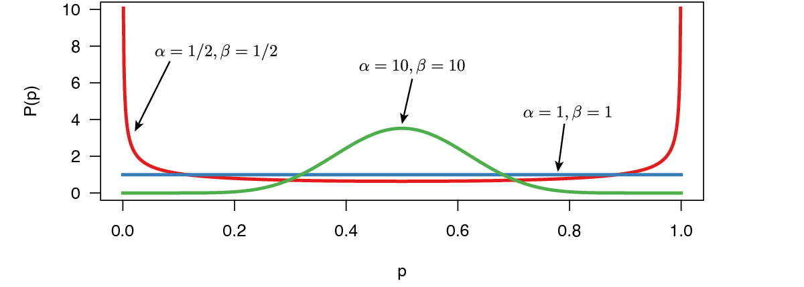
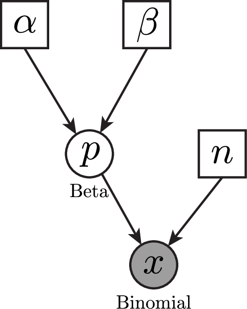
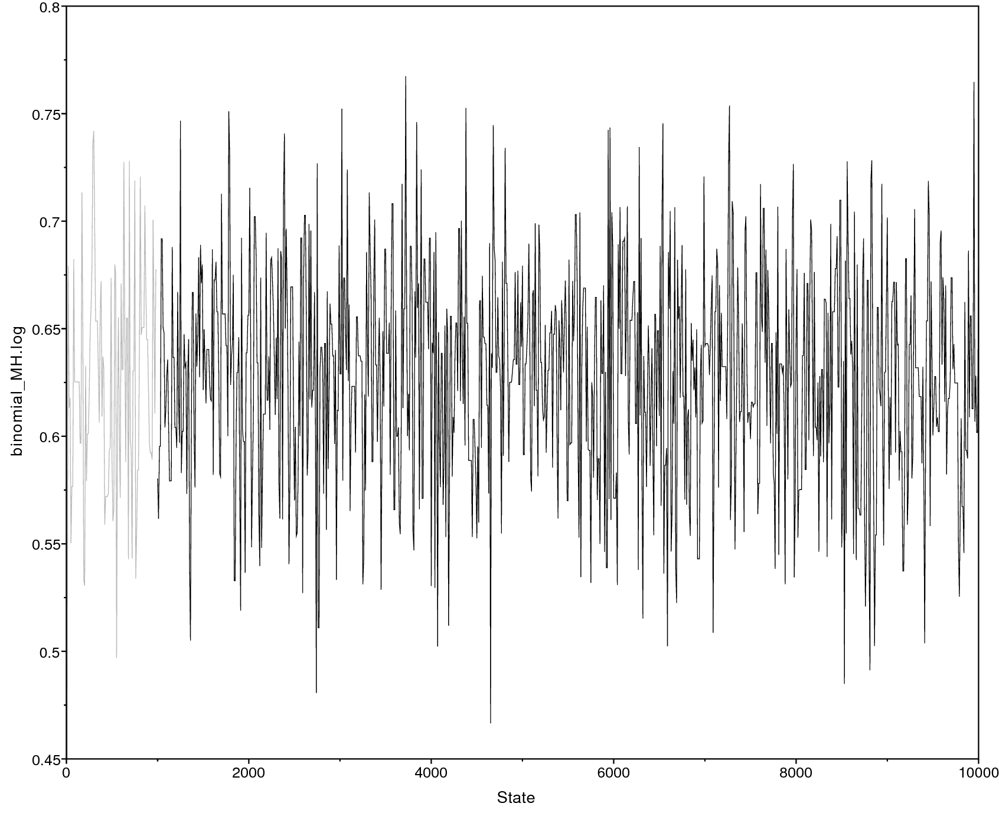
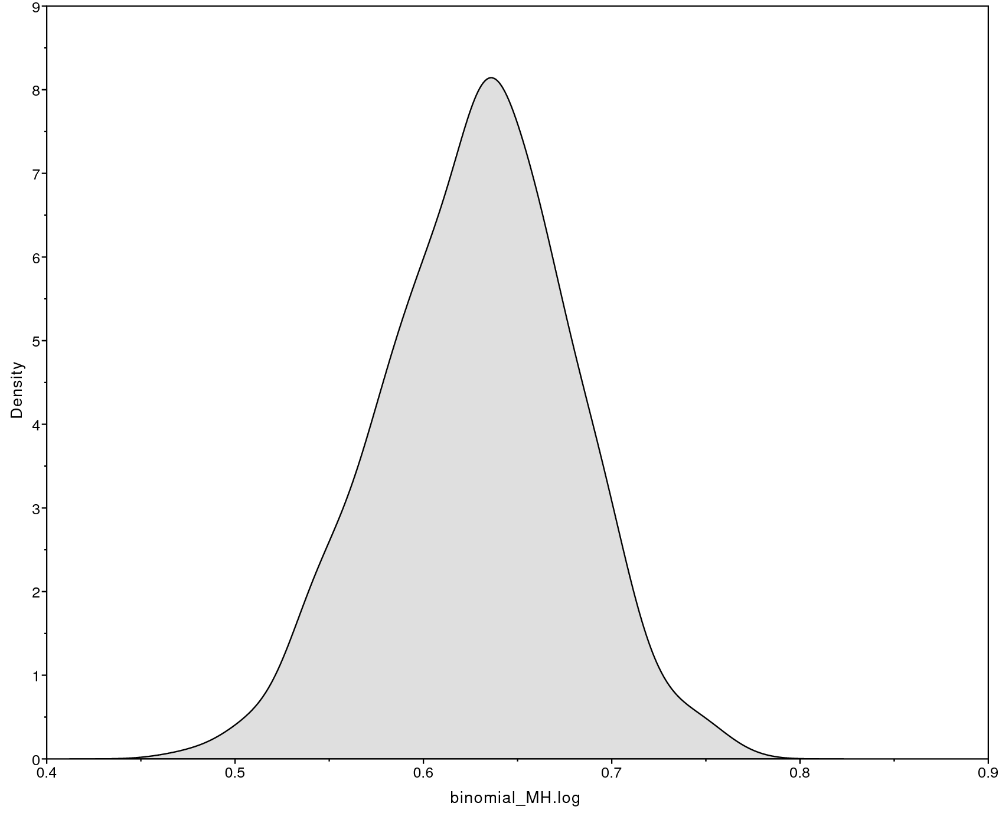

Overview
========

This very basic tutorial provides an introduction to Bayesian inference
and Markov chain Monte Carlo (MCMC) algorithms. The tutorial explains
the fundamental concepts of an MCMC algorithm, such as *moves* and
*monitors*, which are ubiquitous in every other tutorial. After the
tutorial you should be somewhat familiar with Bayesian inference
(*e.g.,*what is a prior distribution,
posterior distribution, and likelihood function) and MCMC simulation
(*e.g.,*what are moves and monitors and why do
we need them).

A Coin Flipping (Binomial) Model
================================

We’ll begin our exploration of Bayesian inference with a simple
coin-flipping model. In this model, we imagine flipping a coin $n$ times
and count the number of heads, $x$; each flip comes up heads with
probability $p$. This model gives rise to the Binomial probability
distribution, with parameters $n$ and $p$: $$\begin{aligned}
P(x \mid n,p) = {n \choose x}p^x(1-p)^{n-x}\end{aligned}$$ Simple
intuition suggests that, given that we observe $x$ heads in $n$ coin
tosses, the maximum-likelihood estimate (MLE) of $p$ is simply
$\frac{x}{n}$: if we flip a coin 100 times and observe 70 heads, we
assume the probability the coin comes up heads is
$\frac{70}{100} = 0.7$. This is indeed the maximum likelihood estimate!

From Bayes’ theorem, the *posterior distribution* of $p$ given $x$,
$P(p \mid x)$, is: $$\begin{aligned\frac{
}{b}ace{P(p \mid x)}^{\text{posterior distribution}} = \frac\frac{ }{b}ace{P(x \mid p)}^{\text{likelihood}} \time\frac{ }{b}ace{P(p)}^{\text{prior}}}{\underbrace{P(x)}_{\text{marginal likelihood}}}\end{aligned}$$
The take-home message here is that, if we’re interested in doing
Bayesian inference for the coin flipping model, we need to specify a
*likelihood function* and a *prior distribution* for $p$. In virtually
all practical cases, we cannot compute the posterior distribution
directly and instead use numerical procedures, such as a Markov chain
Monte Carlo (MCMC) algorithm. Therefore, we will also have to write an
MCMC algorithm that samples parameter values in the frequency of their
posterior probability.

We’ll use a simple beta distribution as a prior on the parameter of the
model, $p$. The beta distribution has two parameters, $\alpha$ and
$\beta$ (Figure [fig:beta_distribution]). Different choices for
$\alpha$ and $\beta$ represent different prior beliefs.

[fig:beta_distribution]

>  
> distribution with two parameters,
$\alpha$ and $\beta$. This distribution is used as a prior distribution
on the probability parameter $p$ of observing a head. Here we show
different curves for the beta distribution when using different
parameters. 
{:.figure}

Figure [fig:binomial_model] shows the graphical model for the
binomial model. This nicely visualizes the dependency structure in the
model. We see that the two parameters $\alpha$ and $\beta$ are drawn in
solid squares, representing that these variables are constant. From
these two variables, we see arrows going into the variable $p$. That
simply means that $p$ depends on $\alpha$ and $\beta$. More
specifically, $p$ is a stochastic variable (shown as a solid circle) and
drawn from a beta distribution with parameters $\alpha$ and $\beta$.
Then, we have another constant variable, $n$. Finally, we have the
observed data $x$ which is drawn from a Binomial distribution with
parameters $p$ and $n$, as can be seen by the arrows going into $x$.
Furthermore, the solid circle of $x$ is shaded which means that the
variable has data attached to it.

[fig:binomial_model]

>  
> ical model
for the binomial model. 
{:.figure}

Writing an MCMC from Scratch
============================

Make yourself familiar with the example script called
*Binomial_MH_algorithm.Rev* which shows the code for the following
sections. Then, start a new and empty script and follow each step
provided in the .

The Metropolis-Hastings Algorithm
---------------------------------

Though `RevBayes` implements efficient and easy-to-use Markov chain
Monte Carlo algorithms, we’ll begin by writing one ourselves to gain a
better understanding of the moving parts. The Metropolis-Hastings MCMC
algorithm {% cite Metropolis1953}  proceeds as follows:

1.  Generate initial values for the parameters of the model (in this
    case, $p$).

2.  Propose a new value (which we’ll call $p^\prime$) for some
    parameters of the model, (possibly) based on their current values

3.  Calculate the acceptance probability, $R$, according to:
    $$\begin{aligned}
    		R = \text{min}\left\{1, \frac{P(x \mid p^\prime)}{P(x \mid p)} \times \frac{P(p^\prime)}{P(p)} \times \frac{q(p)}{q(p^\prime)} \right\}
    	\end{aligned}$$

4.  Generate a uniform random number between 1 and 0. If it is less than
    $R$, accept the move (set $p = p^\prime$). Otherwise, keep the
    current value of $p$.

5.  Record the values of the parameters.

6.  Return to step 2 many many times, keeping track of the value of $p$.

Reading in the data
-------------------

Actually, in this case, we’re just going to make up some data on the
spot. Feel free to alter these values to see how they influence the
posterior distribution

    # Make up some coin flips!
    # Feel free to change these numbers
    n <- 100 # the number of flips
    x <- 63	# the number of heads

Initializing the Markov chain
-----------------------------

We have to start the MCMC off with some initial parameter values. One
way to do this is to randomly draw values of the parameters (just $p$,
in this case) from the prior distribution. We’ll assume a “flat” beta
prior distribution; that is, one with parameters $\alpha = 1$ and
$\beta = 1$.

    # Initialize the chain with starting values
    alpha <- 1
    beta  <- 1
    p <- rbeta(n=1,alpha,beta)[1]

### Likelihood function

We also need to specify the likelihood function. We use the binomial
probability for the likelihood function. Since the likelihood is defined
only for values of $p$ between 0 and 1, we return 0.0 if $p$ is outside
this range:

    # specify the likelihood function
    function likelihood(p) {
        if(p < 0 || p > 1)
            return 0

        l = dbinomial(x,p,n,log=false)
        return l
    }

### Prior distribution

Similarly, we need to specify a function for the prior distribution.
Here, we use the beta probability distribution for the prior on $p$:

    # specify the prior function
    function prior(p) {
        if(p < 0 || p > 1)
            return 0
            
        pp = dbeta(p,alpha,beta,log=false)
        return pp
    }

### Monitoring parameter values

Additionally, we are going to monitor,
*i.e.,*store, parameter values into a file
during the MCMC simulation. For this file we need to write the column
headers:

    # Prepare a file to log our samples
    write("iteration","p","\n",file="binomial_MH.log")
    write(0,p,"\n",file="binomial_MH.log",append=TRUE)

(You may have to change the newline characters to
`\backslashr\backslashn` if you’re using a Windows operating system.)
We’ll also monitor the parameter values to the screen, so let’s print
the initial values:

    # Print the initial values to the screen
    print("iteration","p")
    print(0,p)

Writing the MH Algorithm
------------------------

At long last, we can write our MCMC algorithm. First, let us define the
frequency how often we print to file
(*i.e.,*monitor), which is also often called
thinning. If we set the variable ‘printgen‘ to 1, then we will store the
parameter values every single iteration; if we choose ‘printgen=10‘
instead, then only every $10^{th}$ iteration.

    printgen = 10

We will repeat this resampling procedure many times (here, 10000), and
iterate the MCMC using a `for` loop:

    # Write the MH algorithm
    reps = 10000 
    for(rep in 1:reps){

(remember to close your `for` loop at the end).

The first thing we do in the first generation is generate a new value of
$p^\prime$ to evaluate. We’ll propose a new value of $p$ from a uniform
distribution between 0 and 1. Note that in this first example we do not
condition new parameter values on the current value.

    	# Propose a new value of p
    	p_prime <- runif(n=1,0.0,1.0)[1]

Next, we compute the proposed likelihood and prior probabilities, as
well as the acceptance probability, $R$:

    	# Compute the acceptance probability
    	R <- ( likelihood(p_prime) / likelihood(p) ) * ( prior(p_prime) / prior(p) )

Then, we accept the proposal with probability $R$ and reject otherwise:

    	# Accept or reject the proposal
    	u <- runif(1,0,1)[1]
    	if(u < R){
    		# Accept the proposal
    		p <- p_prime
    	}

Finally, we store the current value of $p$ in our log file. Here, we
actually check if we want to store the value during this iteration.

        if ( (rep % printgen) == 0 ) {
            # Write the samples to a file
            write(rep,p,"\n",file="binomial_MH.log",append=TRUE)
            # Print the samples to the screen
            print(rep,p)
        }
    } # end MCMC

Visualizing the samples of an MCMC simulation
---------------------------------------------

Below we show an example of the obtained output in
`Tracer`. Specifically, Figure [fig:mcmc_samples] shows
the sample trace (left) and the estimated posterior distribution of $p$
(right). There are other parameters, such as the posterior mean and the
95% HPD (highest posterior density) interval, that you can obtain from
`Tracer`.

[fig:mcmc_samples]

>  >
 
> he *Trace* of
sample from an MCMC simulation. Right: The approximated posterior
probability distribution for $p$. 
{:.figure}

More on Moves: Tuning and weights
=================================

In the previous example we hard coded a single move updating the
variable $p$ by drawing a new value from a uniform(0,1) distribution.
There are actually many other ways how to propose new values; some of
which are more efficient than others.

First, let us rewrite the MCMC loop so that we use instead a function,
which we call ‘move_uniform‘ for simplicity, that performs the move:

    for (rep in 1:reps){
        
        # call uniform move
        move_uniform(1)
        
        if ( (rep % printgen) == 0 ) {
            # Write the samples to a file
            write(rep,p,"\n",file="binomial_MH.log",append=TRUE)
        }

    } # end MCMC

This loop looks already much cleaner.

Uniform move
------------

Now we need to actually write the ‘move_uniform‘ function. We mostly
just copy the code we had before into a dedicated function

    function move_uniform( Natural weight) {

        for (i in 1:weight) {
            # Propose a new value of p
            p_prime <- runif(n=1,0.0,1.0)[1]

            # Compute the acceptance probability
            R <- ( likelihood(p_prime) / likelihood(p) ) * ( prior(p_prime) / prior(p) )
        
            # Accept or reject the proposal
            u <- runif(1,0,1)[1]
            if (u < R){
                # Accept the proposal
                p <- p_prime
            } else {
                # Reject the proposal
                # (we don't have to do anything here)
            }
        }
        
    }

There are a few things to consider in the function ‘move_uniform‘.
First, we do not have a return value because the move simply changes the
variable $p$ if the move is accepted. Second, we expect an argument
called ‘weight‘ which will tell us how often we want to use this move.
Otherwise, this function does exactly the same what was inside the for
loop previously.

(Note that you need to define this function before the for loop in your
script).

Sliding-window move
-------------------

As a second move we will write a sliding-window move. The sliding-window
moves propose an update by drawing a random number from a uniform
distribution and then adding this random number to the current value
(*i.e.,*centered on the previous value).

    function move_slide( RealPos delta, Natural weight) {

        for (i in 1:weight) {
            # Propose a new value of p
            p_prime <- p + runiform(n=1,-delta,delta)[1]

            # Compute the acceptance probability
            R <- ( likelihood(p_prime) / likelihood(p) ) * ( prior(p_prime) / prior(p) )
        
            # Accept or reject the proposal
            u <- runif(1,0,1)[1]
            if (u < R) {
                # Accept the proposal
                p <- p_prime
            } else {
                # Reject the proposal
                # (we don't have to do anything here)
            }
        }
        
    }

In addition to the weight of the move, this move has another argument,
‘delta‘. The argument ‘delta‘ defines the width of the uniform window
from which we draw new values. Thus, if ‘delta‘ is large, then the
proposed values are more likely to be very different from the current
value of $p$. Conversely, if ‘delta‘ is small, then the proposed values
are more likely to be very close to the current value of $p$.

Experiment with different values for ‘delta‘ and check how the effective
sample size (ESS) changes.

There is, a priori, no good method for knowing what values of ‘delta‘
are most efficient. However, there are some algorithms implemented in
`RevBayes`, called *auto-tuning*, that will estimate good values for
‘delta‘.

Scaling move
------------

As a third and final move we will write a scaling move. The scaling move
proposes an update by drawing a random number from a uniform(-0.5,0.5)
distribution, exponentiating the random number, and then multiplying
this scaling factor by the current value. An interesting feature of this
move is that it is not symmetrical and thus needs a Hastings ratio. The
Hastings ratio is rather trivial in this case, and one only needs to
multiply the acceptance rate by the scaling factor.

    function move_scale( RealPos lambda, Natural weight) {

        for (i in 1:weight) {
            # Propose a new value of p
            sf <- exp( lambda * ( runif(n=1,0,1)[1] - 0.5 ) )
            p_prime <- p * sf

            # Compute the acceptance probability
            R <- ( likelihood(p_prime) / likelihood(p) ) * ( prior(p_prime) / prior(p) ) * sf
        
            # Accept or reject the proposal
            u <- runif(1,0,1)[1]
            if (u < R){
                # Accept the proposal
                p <- p_prime
            } else {
                # Reject the proposal
                # (we don't have to do anything here)
            }
        }
        
    }

As before, this move has a tuning parameter called *lambda*.

The sliding-window and scaling moves are very common and popular moves
in `RevBayes`. The code examples here are actually showing the exact
same equation as implemented internally. It will be very useful for you
to understand these moves.

However, this MCMC algorithm is *very* specific to our binomial model
and thus hard to extend (also it’s pretty inefficient!).

The Metropolis-Hastings Algorithm with the *Real* `RevBayes`
============================================================

We’ll now specify the exact same model in `Rev` using the built-in
modeling functionality. It turns out that the `Rev` code to specify the
above model is extremely simple and similar to the one we used before.
Again, we start by “reading in” (*i.e.*, making up) our data.

    # Make up some coin flips!
    # Feel free to change these numbers
    n <- 100 # the number of flips
    x <- 63	# the number of heads

Now we specify our prior model.

    # Specify the prior distribution
    alpha <- 1
    beta  <- 1
    p ~ dnBeta(alpha,beta)

One difference between `RevBayes` and the MH algorithm that we wrote
above is that many MCMC proposals are already built-in, but we have to
specify them *before* we run the MCMC. We usually define (at least) one
move per parameter immediately after we specify the prior distribution
for that parameter.

    # Define a move for our parameter, p
    moves[1] = mvSlide(p,delta=0.1,weight=1)

Next, our likelihood model.

    # Specify the likelihood model
    k ~ dnBinomial(p, n)
    k.clamp(x)

We wrap our full Bayesian model into one model object (this is a
convenience to keep the entire model in a single object, and is more
useful when we have very large models):

    # Construct the full model
    my_model = model(p)

We use “monitors” to keep track of parameters throughout the MCMC. The
two kinds of monitors we use here are the `mnModel`, which writes
parameters to a specified file, and the `mnScreen`, which simply outputs
some parts of the model to screen (as a sort of progress bar).

    # Make the monitors to keep track of the MCMC
    monitors[1] = mnModel(filename="binomial_MCMC.log", printgen=10, separator = TAB)
    monitors[2] = mnScreen(printgen=100, p)

Finally, we assemble the analysis object (which contains the model, the
monitors, and the moves) and execute the run using the `.run` command:

    # Make the analysis object
    analysis = mcmc(my_model, monitors, moves)

    # Run the MCMC
    analysis.run(100000)

    # Show how the moves performed
    analysis.operatorSummary()

Open the resulting `binomial_MCMC.log` file in `Tracer`. Do the
posterior distributions for the parameter $p$ look the same as the ones
we got from our first analysis?

Hopefully, you’ll note that this `Rev` model is substantially simpler
and easier to read than the MH algorithm script we began with. Perhaps
more importantly, this `Rev` analysis is *orders of magnitude* faster
than our own script, because it makes use of extremely efficient
probability calculations built-in to `RevBayes` (rather than the ones we
hacked together in our own algorithm).

Exercises for the MCMC Tutorial
===============================

Exercise 1: Performing your first simple MCMC simulation
--------------------------------------------------------

1.  Look into the *Binomial_MH_algorithm.Rev* script and make yourself
    familiar with it. All the commands should be explained in the text
    of the tutorial.

2.  Execute the script *Binomial_MH_algorithm.Rev*).

3.  The `.log` file will contain samples from the posterior distribution
    of the model! Open the file in `Tracer`to learn about
    various features of the posterior distribution, for example: the
    posterior mean or the 95% credible interval.

4.  Save the MCMC trace plot and posterior distribution into a PDF file
    and upload the files. Write here the name of your file:\

Exercise 2: Different MCMC strategies (moves)
---------------------------------------------

1.  Now look into the script called *Binomial_MH_algorithm_moves.Rev*
    which shows the 3 different types of moves described in
    this tutorial.

2.  Run the script to estimate the posterior distribution of $p$ again.

3.  Look at the output in `Tracer`.

4.  Use only a single move and set ‘printgen=1‘. Which move has the best
    ESS? Enter the ESS values for the different moves here:\

5.  How does the ESS change if you use a ‘delta=10‘ for the
    sliding-window move?\

6.  Add to each move a counter variable that counts how often the move
    was accepted. For example:

                if (u < R){
                    # Accept the proposal
                    p <- p_prime
                    ++num_sliding_move_accepted
                } 

7.  Have a look at how the acceptance rate changes for different values
    of the tuning parameters.\

Exercise 3: MCMC in `RevBayes`
------------------------------

1.  Run the built-in MCMC (*Binomial_MCMC.Rev*) and compare the results
    to your own MCMC. Are the posterior estimates the same? Are the ESS
    values similar? Which script was the fastest?\

2.  Next, add a second move ‘moves[2] =
    mvScale(p,lambda=0.1,tune=true,weight=1.0)‘ just after the
    first one.

3.  Run the analysis again and upload your trace file. Write here the
    name of your file:\

4.  Finally, run a pre-burnin using
    ‘analysis.burnin(generations=10000,tuningInterval=200)‘ just before
    you call ‘analysis.run(100000)‘. This will auto-tune the tuning
    parameters (*e.g.,*‘delta‘ and ‘lambda‘)
    so that the acceptance ratio is between 0.4 and 0.5.

5.  What are the tuned values for ‘delta‘ and ‘lambda‘? Did the
    auto-tuning increase the ESS?\

Exercise 4: Approximating the posterior distribution
----------------------------------------------------

Modify the script *Binomial_MCMC.Rev*. Assume you flipped a coin 100
times and got 34 heads. Run the MCMC for 100,000 generations, printing
every 100 samples to the file.

1.  What is the posterior mean estimate of p? The 95% credible
    interval?\

2.  Pretend you flipped the coin 900 more times, for a total of
    1000 flips. Among those 1000 flips, you observed 340 heads (change
    your script accordingly!). What is your posterior mean estimate of p
    now? How has the 95% credible interval changed? Provide an intuitive
    explanation for this change.\

Exercise 5: Exploring prior sensitivity and MCMC settings
---------------------------------------------------------

Play around with various parts of the model to develop on intuition for
both the Bayesian model and the MCMC algorithm. For example, how does
the posterior distribution change as you increase the number of coin
flips (say, increase both the number of flips and the number of heads by
an order of magnitude)? How does the estimated posterior distribution
change if you change the prior model parameters, $\alpha$ and $\beta$
(*i.e.,*is the model prior sensitive)? Does
the prior sensitivity depend on the sample size? Are the posterior
estimates sensitive to the length of the MCMC? Do you think this MCMC
has been run sufficiently long, or should you run it longer? Try to
answer some of these questions and explain your finding here:\

Version dated:
