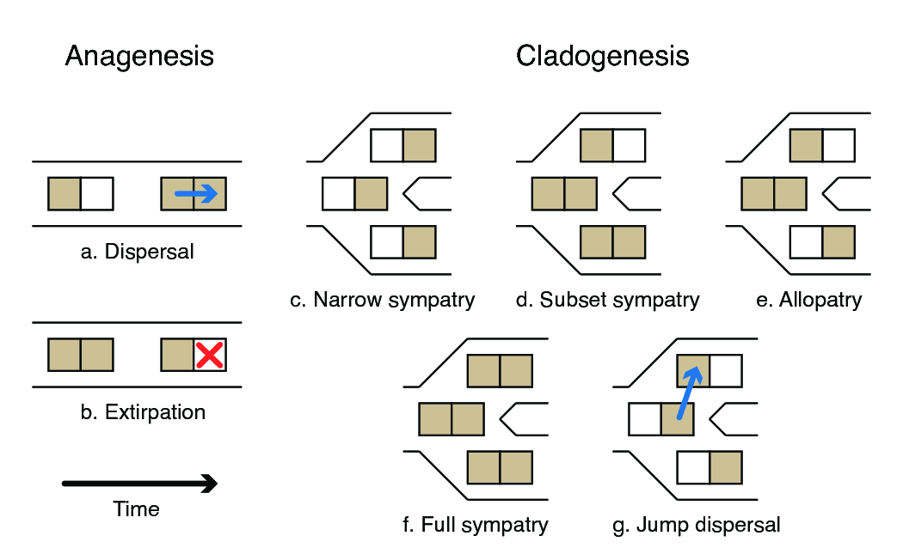
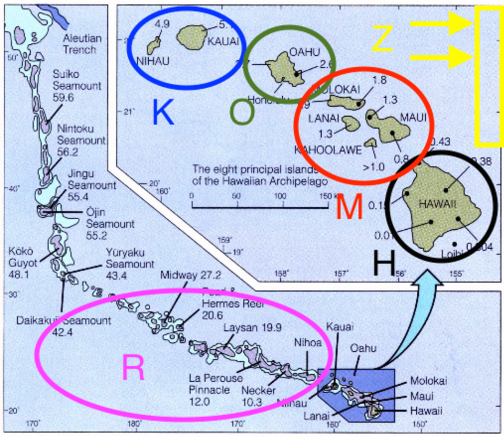
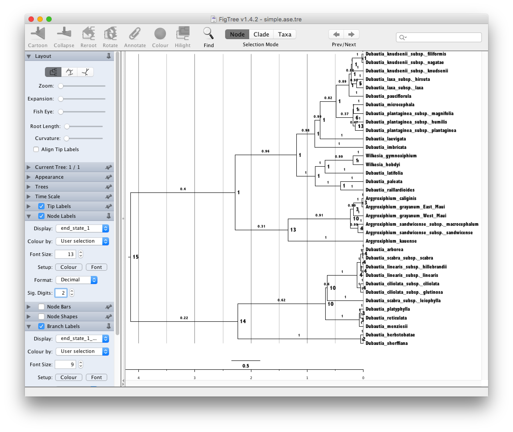
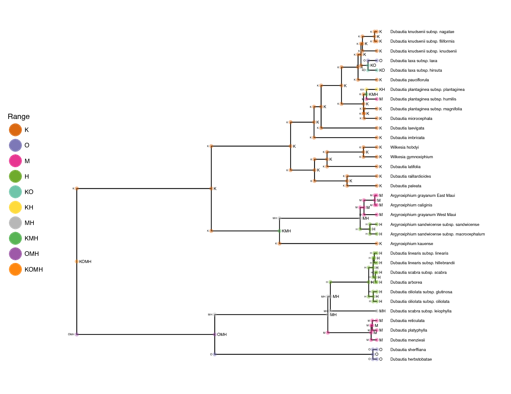
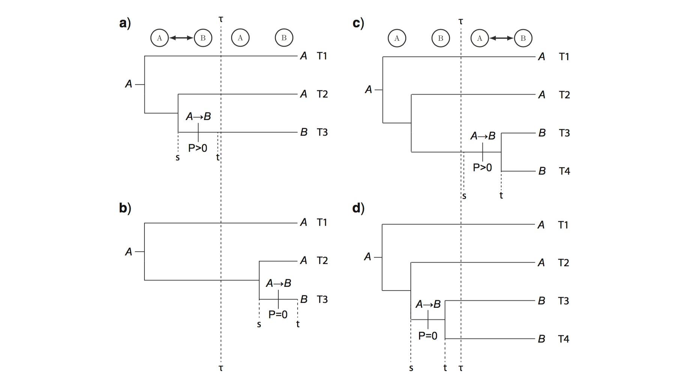
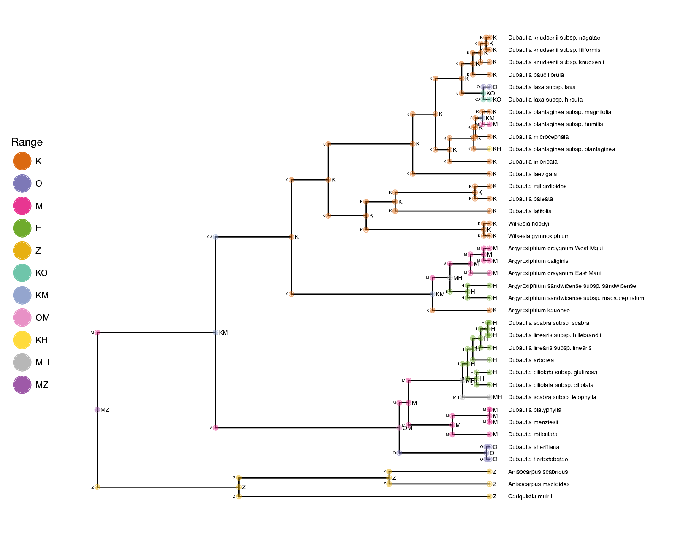
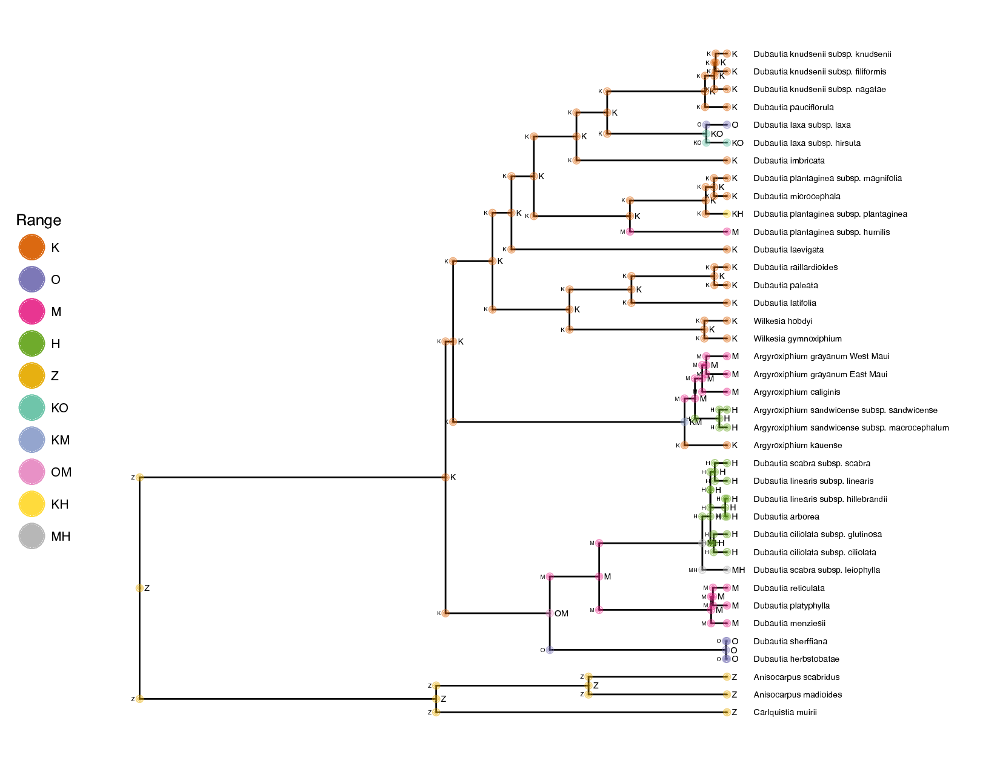
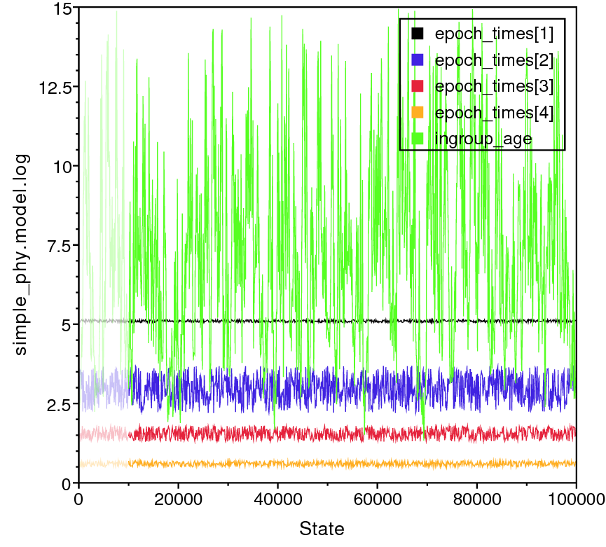
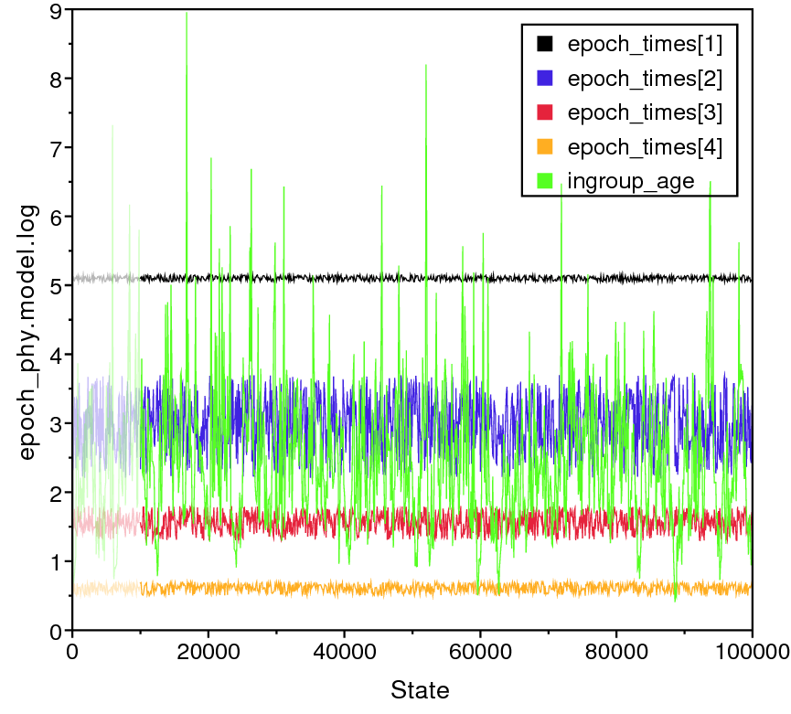

Introduction {#introduction .unnumbered}
------------

Many fundamental evolutionary processes, such as adaptation, speciation,
and extinction, operate in a spatial context. When the historical aspect
of this spatial context cannot be observed directly, as is often the
case, biogeographic inference may be applied to estimate ancestral
species ranges. This works by leveraging phylogenetic, molecular, and
geographical information to model species distributions as the outcome
of biogeographic processes. How to best model these processes requires
special consideration, such as how ranges are inherited following
speciation events, how geological events might influence dispersal
rates, and what factors affect rates of dispersal and extirpation. A
major technical challenge of modeling range evolution is how to
translate these natural processes into stochastic processes that remain
tractable for inference. This tutorial provides a brief background in
some of these models, then describes how to perform Bayesian inference
of historical biogeography using RevBayes.

Contents {#contents .unnumbered}
--------

The Historical Biogeography guide contains several tutorials

-   Section [sec:bg_intro2]: Overview of the
    Dispersal-Extinction-Cladogenesis (DEC) process

-   Section [sec:bg_simple]: A simple DEC analysis

-   Section [sec:bg_epoch]: An improved DEC analysis

-   Section [sec:bg_phylo]: Biogeographic dating using DEC

Recommended tutorials {#recommended-tutorials .unnumbered}
---------------------

The Historical Biogeography tutorials assume the reader is familiar with
the content covered in the following RevBayes tutorials

-   **Rev Basics**

-   **Molecular Models of Character Evolution**

-   **Running and Diagnosing an MCMC Analysis**

-   **Divergence Time Estimation and Node Calibrations**

Overview of the Dispersal-Extinction-Cladogenesis model {#sec:bg_intro2}
=======================================================

The Dispersal-Extinction-Cladogenesis (DEC) process models range
evolution as a discrete-valued process . There are
three key components to understanding the DEC model: range characters,
anagenetic range evolution, and cladogenetic range evolution (Figure
[fig:dec_cartoon]).

>  
> Cartoon of behavior
of the DEC model.Two anagenetic events (a,b) and five cladogenetic (c–g)
events are shown for a system with two areas.Areas are shaded when
inhabited by a given lineage and left blank when uninhabited.Time
proceeds from left to right.(a) Dispersal: a new area to be added to the
species range.(b) Extirpation (or local extinction): the species range
loses a previously inhabited area.(c) Narrow sympatry: When the
ancestral range contains one area, both daughter lineages inherit that
area.(d) Subset sympatry: When the ancestral range is widespread, one
daughter inherits the ancestral range and the other daughter inherits
only one area.(e) Allopatry (or vicariance): When the ancestral range is
widespread, one daughter lineage a subset of the ancestral areas while
the other daughter inherits all remaining ancestral areas.(f) Widespread
sympatry: When the ancestral range is widespread, both daughters inherit
the ancestral range.(g) Jump dispersal (or founder speciation): One
daughter inherits the ancestral range while the other daughter inherits
a new unoccupied area. 
{:.figure}

Discrete range characters
-------------------------

DEC interprets taxon ranges as presence-absence data, that is, where a
species is observed or not observed across multiple discrete areas. For
example, say there are three areas, A, B, and C. If a species is present
in areas A and C, then its range equals AC, which can also be encoded
into the length-3 bit vector, 101. Bit vectors may also be transformed
into (decimal) integers, *e.g.*, the binary
number 101 equals the decimal number 5.

  Range           Bits  Size   State
  ------------- ------ ------ -------
  $\emptyset$      000   0       0
  A                100   1       1
  B                010   1       2
  C                001   1       3
  AB               110   2       4
  AC               101   2       5
  BC               011   2       6
  ABC              111   3       7

  : Example of discrete range representations for an analysis with areas
  A, B, and C.

The decimal representation of range states is rarely used in discussion,
but it is useful to keep in mind when considering the total number of
possible ranges for a species and when processing output.

Anagenetic range evolution
--------------------------

In the context of the DEC model, anagenesis refers to range evolution
that occurs between speciation events within lineages. There are two
types of anagenetic events, dispersal (Figure [fig:dec_cartoon]a) and
(local) extinction or exitrpation (Figure [fig:dec_cartoon]b).
Because DEC uses discrete-valued ranges, anagenesis is modeled using a
continuous-time Markov chain. This, in turn, allows us to compute
transition probability of a character changing from $i$ to $j$ in time
$t$ through matrix exponentiation
$$\mathbf{P}_{ij}(t) = \left[ \exp \left\lbrace \mathbf{Q}t \right\rbrace \right]_{ij},$$
where $\textbf{Q}$ is the instantaneous rate matrix defining the rates
of change between all pairs of characters, and $\textbf{P}$ is the
transition probability rate matrix. The indices $i$ and $j$ represent
different ranges, each of which is encoded as the set of areas occupied
by the species. The probability has integrated over all possible
scenarios of character transitions that could occur during $t$ so long
as the chain begins in range $i$ and ends in range $j$. We can then
encode ${\bf Q}$ to reflect the allowable classes of range evolution
events with biologically meaningful parameters. For three areas, the
rates in the anagenetic rate matrix are

$$\textbf{Q} = 
	\begin{array}{c|cccccccc}
		& \emptyset & A & B & C & AB & AC & BC & ABC \\
		\hline
		\emptyset 	& - 	& 0 	& 0 	& 0 		& 0			& 0 		& 0 		& 0 \\
		A 			& e_A 	& - 	& 0 	& 0 		& d_{AB}	& d_{AC} 	& 0 		& 0 \\
		B 			& e_B 	& 0 	& - 	& 0 		& d_{BA}	& 0 		& d_{BC} 	& 0 \\
		C 			& e_C 	& 0 	& 0 	& - 		& 0 		& d_{CA} 	& d_{CB} 	& 0 \\
		AB 			& 0 	& e_A 	& e_B 	& 0 		& -			& 0 		& 0 		& d_{AC} + d_{BC} \\
		AC 			& 0 	& e_C 	& 0 	& e_A 		& 0			& - 		& 0 		& d_{AB} + d_{CB} \\
		BC 			& 0 	& 0 	& e_C 	& e_B 		& 0			& 0 		& - 		& d_{BA} + d_{CA} \\
		ABC 		& 0 	& 0 	& 0 	& 0 		& e_C 		& e_B 		& e_A 		& - \\								
	\end{array}$$

where $e = ( e_A, e_B, e_C )$ are the (local) extinction rates per area,
and $d = ( d_{AB}, d_{AC}, d_{BC}, d_{BA}, d_{CA}, d_{CB})$ are the
dispersal rates between areas. Notice that the sum of rates leaving the
null range ($\emptyset$) is zero, meaning any lineage that loses all
areas in its range remains that way permanently.

To build our intuition, let's construct a DEC rate matrix in RevBayes.
Assume you have three areas

    n_areas <- 3

First, create a matrix of dispersal rates between area pairs, with rates
$d_{AB} = d_{AC} = \ldots = d_{CB} = 1$.

    for (i in 1:n_areas) {
        for (j in 1:n_areas) {
            dr[i][j] <- 1.0
        }
    }

Next, let's create the extirpation rates with values $e_A=e_B=e_C=1$

    for (i in 1:n_areas) {
        for (j in 1:n_areas) {
            er[i][j] <- 0.0
        }
        er[i][i] <- 1.0
    }

When the extirpation rate matrix is a diagonal matrix (i.e. all
non-diagonal entries are zero), extirpation rates are mutually
independent as in . More complex models that penalize
widespread ranges that span disconnected areas are explored in later
sections.

To continue, create the DEC rate matrix from the dispersal rates
(dr) and extirpation rates (er).

    Q_DEC := fnDECRateMatrix(dispersalRates=dr, extirpationRates=er)
    Q_DEC

~~~
    [ [ 0.0000, 0.0000, 0.0000, 0.0000, 0.0000, 0.0000, 0.0000, 0.0000 ] ,
        1.0000, -3.0000, 0.0000, 0.0000, 1.0000, 1.0000, 0.0000, 0.0000 ] ,
        1.0000, 0.0000, -3.0000, 0.0000, 1.0000, 0.0000, 1.0000, 0.0000 ] ,
        1.0000, 0.0000, 0.0000, -3.0000, 0.0000, 1.0000, 1.0000, 0.0000 ] ,
        0.0000, 1.0000, 1.0000, 0.0000, -4.0000, 0.0000, 0.0000, 2.0000 ] ,
        0.0000, 1.0000, 0.0000, 1.0000, 0.0000, -4.0000, 0.0000, 2.0000 ] ,
        0.0000, 0.0000, 1.0000, 1.0000, 0.0000, 0.0000, -4.0000, 2.0000 ] ,
        0.0000, 0.0000, 0.0000, 0.0000, 1.0000, 1.0000, 1.0000, -3.0000 ] ]
~~~
{:.rev-output}


Compute the anagenetic transition probabilities for a branch of length
0.2.

    tp_DEC <- Q_DEC.getTransitionProbabilities(rate=0.2)
    tp_DEC

~~~
    [ [ 1.000, 0.000, 0.000, 0.000, 0.000, 0.000, 0.000, 0.000],
      [ 0.000, 0.673, 0.013, 0.013, 0.123, 0.123, 0.005, 0.050],
      [ 0.000, 0.013, 0.673, 0.013, 0.123, 0.005, 0.123, 0.050],
      [ 0.000, 0.013, 0.013, 0.673, 0.005, 0.123, 0.123, 0.050],
      [ 0.000, 0.107, 0.107, 0.004, 0.502, 0.031, 0.031, 0.218],
      [ 0.000, 0.107, 0.004, 0.107, 0.031, 0.502, 0.031, 0.218],
      [ 0.000, 0.004, 0.107, 0.107, 0.031, 0.031, 0.502, 0.218],
      [ 0.000, 0.021, 0.021, 0.021, 0.107, 0.107, 0.107, 0.616]]
~~~
{:.rev-output}


Notice how the structure of the rate matrix is reflected in the
transition probability matrix. For example, ranges that are separated by
multiple dispersal and extirpation events are the most improbable:
transitioning from going from A to BC takes a minimum of three events
and has probability 0.005.

Also note that the probability of entering or leaving the null range is
zero. By default, the RevBayes conditions the anagenetic range
evolution process on never entering the null range when computing the
transition probabilities (nullRange="CondSurv"). This
allows the model to both simulate and infer using the same transition
probabilities. @Massana2015 first noted that the null range—an
unobserved absorbing state—results in abnormal extirpation rate and
range size estimates. Their proposed solution to eliminate the null
range from the state space is enabled with the
nullRange="Exclude" setting. The
nullRange="Include" setting provides no special handling of
the null range, and produces the raw probabilities of @Ree2005.

Cladogenetic range evolution
----------------------------

The cladogenetic component of the DEC model describes evolutionary
change accompanying speciation events (Figure [fig:dec_cartoon]c–g).
In the context of range evolution, daughter species do not necessarily
inherit their ancestral range in an identical manner. For each internal
node in the reconstructed tree, one of several cladogenetic events can
occur, some of which are described below.

Beginning with the simplest case first, suppose the range of a species
is $A$ the moment before speciation occurs at an internal phylogenetic
node. Since the species range is size one, both daughter lineages
necessarily inherit the ancestral species range ($A$). In DEC parlance,
this is called a narrow sympatry event (Figure [fig:dec_cartoon]c).
Now, suppose the ancestral range is $ABC$. Under subset sympatry, one
lineage identically inherits the ancestral species range, $ABC$, while
the other lineage inherits only a single area, i.e. only $A$ or $B$ or
$C$ (Figure [fig:dec_cartoon]d). Under allopatric cladogenesis, the
ancestral range is split evenly among daughter lineages, e.g. one
lineage may inherit $AB$ and the other inherits $C$ (Figure
[fig:dec_cartoon]e). For widespread sympatric cladogenesis, both
lineages inherit the ancestral range, $ABC$ (Figure
[fig:dec_cartoon]f). Finally, supposing the ancestral range is $A$,
jump dispersal cladogenesis results in one daughter lineage inheriting
the ancestral range $A$, and the other daughter lineage inheriting a
previously uninhabited area, $B$ or $C$ (Figure [fig:dec_cartoon]g).
See @Matzke2012 for an excellent overview of the cladogenetic state
transitions described in the literature.

Make the cladogenetic probability event matrix

    clado_event_types = [ "s", "a" ]
    clado_event_probs <- simplex( 1, 1 )
    P_DEC := fnDECCladoProbs(eventProbs=clado_event_probs,
                             eventTypes=clado_event_types,
                             numCharacters=n_areas)

`clado_event_types` defines what cladogenetic event types
are used. "a" and "s" indicate allopatry and
subset sympatry, as described in . Other cladogenetic events
include jump dispersal ["j"]  and full sympatry
["f"} . The cladogenetic event probability
matrix will assume that eventProbs and
eventTypes share the same order.

Print the cladogenetic transition probabilities

    P_DEC


```
       [
         ( 1 -> 1, 1 ) = 1.0000,
         ( 2 -> 2, 2 ) = 1.0000,
         ( 3 -> 3, 3 ) = 1.0000,
         ...
         ( 7 -> 7, 1 ) = 0.0833,
         ( 7 -> 7, 2 ) = 0.0833,
         ( 7 -> 7, 3 ) = 0.0833
       ]
```
{:.rev-output}


The cladogenetic probability matrix becomes very sparse for large
numbers of areas, so only non-zero values are shown. Each row reports a
triplet of states—the ancestral state and the two daughter states—with
the probability associated with that event. Since these are proper
probabilities, the sum of probabilities for a given ancestral state over
all possible cladogenetic outcomes equals one.

Things to consider
------------------

The probabilities of anagenetic change along lineages must account for
all combinations of starting states and ending states. For 3 areas,
there are 8 states, and thus $8 \times 8 = 64$ probability terms for
pairs of states. For cladogenetic change, we need transition
probabilities for all combinations of states before cladogenesis, after
cladogenesis for the left lineage, and after cladogenesis for the right
lineage. Like above, for three areas, there are 8 states, and
$8 \times 8 \times 8 = 512$ cladogenetic probability terms.

Of course, this model can be specified for more than three areas. Let's
consider what happens to the size of **Q** when the number of areas,
$N$, becomes large. For three areas, **Q** is size $8 \times 8$. For ten
areas, **Q** is size $2^{10} \times 2^{10} = 1024 \times 1024$, which
approaches the largest size matrices that can be exponentiated in a
practical amount of time. For twenty areas, **Q** is size
$2^{20} \times 2^{20} \approx 10^6 \times 10^6$ and exponentiation is
not viable. Thus, selecting the discrete areas for a DEC analysis should
be done with regard to what one hopes to learn through the analysis
itself.

Some questions
--------------

 **For the three-area DEC rate matrix above, what is the rate of
leaving state AC in terms of dispersal and extinction
parameters?**

 **What series of transition events might explain a lineage
evolving from range $ABC$ to range $A$? From range $AB$ to range $C$?
(Hint: more than one event is needed!)**

 **Imagine a DEC rate matrix with four areas, $ABCD$. What would
be the dispersal rate for $Q_{BC,BCD}$? How many states does a DEC rate
matrix with four areas have? What is the relationship between the number
of areas and the number of states under the DEC model?** 

 **Given the state is $AB$ before cladogenesis, and allowing
subset sympatry, widespread sympatry, and allopatry, what are the 7
possible states in the daughter lineages after cladogenesis?**

 **For three areas, there are three narrow, four widespread, 18
subset sympatric events, and 12 allopatric cladogenesis events. What
proportion of terms in the cladogenesis matrix are zero?**

Simple DEC analysis {#sec:bg_simple}
===================

The following series of tutorials will estimate the ancestral ranges of
the silversword alliance (Tribe *Madiinae*), a young and
diverse clade of about 50 species and subspecies. Although silverswords
are endemic to Hawaii, they are nested within a larger clade alongside
tarweeds, which are native to western continental North America
. The size and age of the silversword clade, combined with
our knowledge of Hawaiian island formation, makes it an ideal system to
explore concepts in historical biogeography and phylogeny. For further
reading, consult: @Carlquist1959 .


>  
> A beautiful figure of the
discrete areas for the tutorial. Six areas are shown: Kauai and Niihau
(K); Oahu (O); Maui-Nui, Lanai, and Molokai (M); Hawaii (H); the
remaining Hawaiian islands (R); and the North American mainland (Z).

{:.figure}

For this tutorial we'll focus entirely on the silversword alliance and
the modern Hawaiian archipelago. To begin, we'll use just four areas, K,
O, M, and H, and include areas R and Z in later analyses (Figure
[fig:hawaii_areas]). The species ranges used in this exercise follow
@Gillespie2009.

  Range         Areas    Size   State
  ------------- ------- ------ -------
  $\emptyset$   0000      0       0
  K             1000      1       1
  O             0100      1       2
  M             0010      1       3
  H             0001      1       4
  KO            1100      2       5
  KM            1010      2       6
  OM            0110      2       7
  KH            1001      2       8
  OH            0101      2       9
  MH            0011      2      10
  KOM           1110      3      11
  KOH           1101      3      12
  KMH           1011      3      13
  OMH           0111      3      14
  KOMH          1111      4      15

  : Area coding used for four areas: K is Kauai and Nihoa; O is Oahu; M
  is Maui Nui, Lanai, and Molokai; H is Hawaii island.

Analysis {#analysis .unnumbered}
--------

First, create file management variables for input and output

    range_fn = "data/n4/silversword.n4.range.nex"
    tree_fn = "data/n4/silversword.tre"
    out_fn = "output/simple"

then read in our character data as binary presence-absence characters

    dat_range_01 = readDiscreteCharacterData(range_fn)

then encode the species ranges into natural numbers

    dat_range_n    = formatDiscreteCharacterData(dat_range_01, "DEC")

Record the number of areas (characters) from the discrete character data
object

    n_areas = dat_range_01.nchar()

You can view the taxon data to see how characters are coded both as
human-readable presence-absence data and as computer-readable natural
numbers

    dat_range_01[1]

~~~
      Argyroxiphium_grayanum_East_Maui:
        0010
    dat_range_n[1]
      Argyroxiphium_grayanum_East_Maui:
        3
~~~
{:.rev-output}


We'll want to record the relationship between range states and range
labels when producing an ancestral range estimate figure. First, store
the vector of range state descriptions

    state_desc = dat_range_n.getStateDescriptions()

then write it to file

    state_desc_str = "state,range\n"
    for (i in 1:state_desc.size())
    {
        state_desc_str += (i-1) + "," + state_desc[i] + "\n"
    }
    write(state_desc_str, file=out_fn+".state_labels.txt")

For this tutorial we'll assume we know the dated species phylogeny
without error.

    tree <- readTrees(tree_fn)[1]

Next, we'll build the anagenetic rate matrix for the DEC model. In its
simplest form, the rate matrix requires a dispersal rate and an
extirpation rate. For this analysis, we'll assume that all pairs of
areas share the same dispersal rate and all areas share the same
extirpation rate. To gain greater control to observe and manage prior
sensitivity, we'll reparameterize the DEC rate matrix to report the
*relative* rates of dispersal versus extirpation events. In
order for anagenetic event rates to be measured on an absolute time
scale (*e.g.*, in millions of years), we will also introduce a a
biogeographic rate parameter, similar to the molecular clock parameter
used in dating analyses.

First, create a parameter for the arrival rate of anagenetic range
evolution events. We'll apply an uninformative prior to the rate's
magnitude by first assigning a uniform distribution to the log$_{10}$
rate.

    log10_rate_bg ~ dnUniform(-4,2)
    log10_rate_bg.setValue(-2)
    moves[1] = mvSlide(log10_rate_bg, weight=4)

then convert the rate from log-scale to linear-scale with a
deterministic node

    rate_bg := 10^log10_rate_bg

This yields a uniform prior over orders of magnitude, ranging from
$10^{-4}$ to $10^2$ events per million years.

Because the rate matrix will describe the relative anagenetic event
rates, we can safely assume that dispersal occurs at the relative
(fixed) rate of one.

    dispersal_rate <- 1.0

then create the dispersal rate matrix

    for (i in 1:n_areas) {
      for (j in 1:n_areas) {
        dr[i][j] <- dispersal_rate
      }
    }

Next, assign a prior distribution to the relative extirpation rate and
assign it a move. The prior distribution of extirpation rates is given
log_sd and log_mean values that give the
prior expected value of one – i.e. the mean rate of area gain and area
loss are equal under the prior.

    log_sd <- 0.5
    log_mean <- ln(1) - 0.5*log_sd^2
    extirpation_rate ~ dnLognormal(mean=log_mean, sd=log_sd)
    moves[2] = mvScale(extirpation_rate, weight=2)

then create a matrix of extirpation rates

    for (i in 1:n_areas) {
      for (j in 1:n_areas) {
        er[i][j] <- 0.0       
      }
      er[i][i] := extirpation_rate
    }

Note that er is a diagonal matrix whose diagonal values are
determined (`:=`) by the stochastic variable,
extirpation_rate. We can now create our relative rate
matrix, Q_DEC, with the fnDECRateMatrix
function.

    Q_DEC := fnDECRateMatrix(dispersalRates=dr, extirpationRates=er)

Note, fnDECRateMatrix does not rescale its elements in any
way, so transition rates share the same time scale as the underlying
tree. This scaling is in contrast to the standard molecular substitution
processes that are available in RevBayes, such as fnGTR,
whose rates are rescaled such that the process is expected to produce
one event per site per unit time.

Next, we need to create the cladogenetic probability matrix.
Cladogenetic event probabilities are given by a transition probability
matrix, not a rate matrix. First, we will provide the vector to indicate
that we wish to consider only subset sympatry and allopatry events.
Next, we will create a vector of prior weights on cladogenesis events
that fixes all cladogenetic events to be equiprobable.

    clado_event_types <- [ "s", "a" ]
    clado_event_probs <- simplex(1, 1)
    P_DEC := fnDECCladoProbs(eventProbs=clado_event_probs,
                                eventTypes=clado_event_types,
                                numCharacters=n_areas)

Finally, all our DEC model components are encapsulated in the
dnPhyloCTMCClado distribution, which is similar to
dnPhyloCTMC except specialized to integrate over
cladogenetic events. Although this dataset has four areas, it is
recognized single character with states valued from 1 to $2^4$, hence
nSites=1.

    m_bg ~ dnPhyloCTMCClado(tree=tree,
                               Q=Q_DEC,
                               cladoProbs=P_DEC,
                               branchRates=rate_bg,
                               nSites=1,
                               type="NaturalNumbers")

Finally, attach the observed ranges to the model. Be sure to use the
natural number valued range characters, dat_range_n, and
not the presence-absence range characters, dat_range_01.

    m_bg.clamp(dat_range_n)

Add the monitors.

    monitors[1] = mnScreen(rate_bg, extirpation_rate, printgen=100)
    monitors[2] = mnModel(file=out_fn+".params.log", printgen=10)
    monitors[3] = mnFile(tree, file=out_fn+".tre", printgen=10)
    monitors[4] = mnJointConditionalAncestralState(tree=tree,
                                                        ctmc=m_bg,
                                                        filename=out_fn+".states.log",
                                                        type="NaturalNumbers",
                                                        printgen=10,
                                                        withTips=true,
                                                        withStartStates=true)

The mnJointConditionalAncestralState monitor samples
ancestral states from the phylogeny, tree, according to the
model of evolution, m_bg, and stores it to the file named
"simple.states.log". Each row in the states file lists the
joint sample of ancestral states conditioned on the tip values for the
entire tree (i.e. a *joint* ancestral state sample
*conditional* on the tip states). Each column corresponds
to the phylogenetic node index for that particular MCMC sample. The
index is used used to match the state samples with the tree samples,
which is especially important when the topology is a random variable
(Section [sec:bg_phylo]).

The remaining tasks should be familiar from previous tutorials, so we
can proceed briskly. Prepare the model graph for analysis by creating a
Model object.

    mymodel = model(m_bg)

Create the MCMC object from the model, moves, and monitors
variables, and run the MCMC analysis.

    mymcmc = mcmc(mymodel, moves, monitors)
    mymcmc.run(3000)

Results {#results .unnumbered}
-------

*Example results are located at* 

The script located at scripts/make_anc_states.Rev
contains code to construct an ancestral state tree. Like all RevBayes
scripts, this script may be executed from the command line. Because this
is the first time using the script, we'll enter the code manually. To
use it for future analyses, just modify the out_str
variable to match the prefix of the target analysis, save the file, then
execute the script by typing "rb
scripts/make_anc_states.Rev" into the command line.


>  
> Annotated tree with
ancestral state estimates in `FigTree`.This tree was
generated by ancestralStateTree in RevBayes.The most
probable end state of each branch (before cladogenesis) is shown at each
node.Branches are labeled with the posterior probability for the
ancestral state on the tipwards end of the branch. 
{:.figure}

After opening a new RevBayes session, create helper variables for
files we'll work with.

    out_str = "output/simple"
    out_state_fn = out_str + ".states.log"
    out_tree_fn = out_str + ".tre"
    out_mcc_fn = out_str + ".mcc.tre" 

Build a maximum clade credibility tree from the posterior tree
distribution, discarding the first 25% of samples. (Note, this step is
gratuitous when we assume a fixed phylogeny, but essential when we
estimate the phylogeny in Section [sec:bg_phylo]).

    tree_trace = readTreeTrace(file=out_tree_fn, treetype="clock")
    tree_trace.setBurnin(0.25)
    n_burn = tree_trace.getBurnin()

Compute and save the maximum clade credibility tree

    mcc_tree = mccTree(tree_trace, file=out_mcc_fn)

Get the ancestral state trace from simple.states.log

    state_trace = readAncestralStateTrace(file=out_state_fn)

Get the ancestral state tree trace from simple.tre. It is
important to use readAncestralTreeTrace and not
readTreeTrace to properly annotate the tree with ancestral
states.

    tree_trace = readAncestralStateTreeTrace(file=out_tree_fn, treetype="clock")

Finally, compute and save the ancestral state tree as
simple.ase.tre.

    anc_tree = ancestralStateTree(tree=mcc_tree,
                                  ancestral_state_trace_vector=state_trace,
                                  tree_trace=tree_trace,
                                  include_start_states=true,
                                  file=out_str+".ase.tre",
                                  burnin=n_burn,
                                  site=0)

We can review the output from ancestralStateTree in
`FigTree`(Figure [fig:simple_FigTree_ase]).

Ancestral state trees are annotated with the first three most probable
ancestral states along with their posterior probabilities. When the tree
is a random variable, as it is in later exercises, additional
information about phylogenetic uncertainty is reported.

Finally, we can also generate a figure with ancestral states that is
suitable for publication using the `R`package
RevGadgets (Figure [fig:simple_RevGadgets_ase]). The
script is easily modified for use with different datasets. To create
build a figure, open an `R`session and load the plotting
script with the source function

    source("plot_anc_state.simple.R")


>  
> Tree with
ancestral state estimates for the "simple" analysis. Nodes are annotated
with ancestral states before and after cladogenetic events. The
ancestral range with the highest posterior probability is shown. Colors
of markers indicate the range state. 
{:.figure}

Notice that the model infers a widespread ancestral range for the clade
(KOMH) approximately four million years ago when only Kauai existed.
Similar geologically unrealistic widespread ranges are estimated for the
*Agyroxiphium* clade (KMH) and the *D.
sheriffiana* and *D. arborea* clade (OMH). The
remaining tutorials will focus on improvements to the simple DEC model
presented here.

An improved DEC analysis {#sec:bg_epoch}
========================

In this section, we'll introduce a suite of model features that lend
towards more realistic biogeographic analyses. Topics include applying
range size constraints, stratified (or epoch) models of
paleoconnectivity, function-valued dispersal rates, and incorporating
uncertainty in paleogeographic event time estimates. These modifications
should produce more realistic ancestral range estimates, e.g. that a
volcanic island may only be colonized once it has formed, and that
distance should have some bearing on dispersal rate.

To accomplish this, we'll incorporate (paleo-)geographical data for the
Hawaiian archipelago, summarized in Table [tab:paleogeo]. Even though
we will continue to use four areas (K, O, M, H) in this section, we will
use all six areas (R, K, O, M, H, Z) in Section [sec:bg_phylo], hence
the full table is given for future reference.

  area             code   $a_{max}$   $a_{min}$   $g_{\bullet R}$   $g_{\bullet K}$   $g_{\bullet O}$   $g_{\bullet M}$   $g_{\bullet H}$   $g_{\bullet Z}$
  --------------- ------ ----------- ----------- ----------------- ----------------- ----------------- ----------------- ----------------- -----------------
  Older islands     R         -           -              -                261               406               500               680              3900
  Kauai             K       5.15        5.05             -                 -                145               239               419              3900
  Oahu              O        3.7         2.2             -                 -                 -                059               239              3900
  Maui Nui          M        1.8         1.3             -                 -                 -                 -                082              3900
  Hawaii            H        0.7         0.3             -                 -                 -                 -                 -               3900
  Mainland          Z         -           -              -                 -                 -                 -                 -                 -

  : Hawaiian paleogeographic data. The six areas are given in Figure
  [fig:hawaii_areas]. Ages $a_{max}$ and $a_{min}$ report the maximum
  and minimum origination times for the given island [adapted from
  @Neall2008]. Distances $g_{ij}$ report the shortest geographical
  distance from the coast of the row's area to the column's area
  (measured at present).<span data-label="tab:paleogeo">

Analysis
--------

Start by creating variables for the tree file, the range data, and the
output prefix

    range_fn = "data/n4/silversword.n4.range.nex"
    tree_fn = "data/n4/silversword.tre"
    out_fn = "output/epoch"

The paleogeographical information from Table [tab:paleogeo] is encoded
in three files named hawaii.n4.times.txt,
hawaii.n4.distances.txt, and
hawaii.n4.connectivity.\*.txt.

    geo_fn = "data/n4/hawaii.n4"
    times_fn = geo_fn + ".times.txt"
    dist_fn = geo_fn + ".distances.txt"

Create move index (mvi) and monitor index
(mni) variables to populate the elements of our
moves and monitors vectors, respectively.

    mvi = 1
    mni = 1

Read in the presence-absence range characters and record the number of
areas in the dataset

    dat_range_01 = readDiscreteCharacterData(range_fn)
    n_areas <- dat_range_01.nchar()

Often, biogeographers wish to limit to the maximum allowable range size.
This prohibits widespread species ranges and reduces the total number of
range states in the analysis, thus improving computational efficiency.
We will restrict ranges from including more than two areas. The total
number of ranges equals $\sum_{k=0}^m {n}\choose{k}$ where $n$ is the
total number of areas, $m$ is the maximum number of permissible areas,
and ${n}\choose{k}$ is the number of ways to sample $k$ unordered
areas from a pool of $n$ areas. For $n=4$ and $m=2$, this equals
${4}\choose{0} + {4}\choose{1} + {4}\choose{2} = 1 + 4 + 6 = 11$
states.

First, compute the number of states

    max_areas <- 2
    n_states <- 0
    for (k in 0:max_areas) n_states += choose(n_areas, k)

then use n_states to format the dataset for the reduced
state space

    dat_range_n = formatDiscreteCharacterData(dat_range_01, "DEC", n_states)

Our state space now includes only 11 states ($\emptyset$, K, O, M, H,
KO, KM, OM, KH, OH, MH).

Record the complete list of range descriptions to file

    state_desc = dat_range_n.getStateDescriptions()
    state_desc_str = "state,range\n"
    for (i in 1:state_desc.size())
    {
        state_desc_str += (i-1) + "," + state_desc[i] + "\n"
    }
    write(state_desc_str, file=out_fn+".state_labels.txt")

As with the previous analysis, we'll brazenly assume we know the dated
species phylogeny without error.

    tree <- readTrees(tree_fn)[1]

Next, we'll read and structure our paleogeographic data. Read in the
list of minimum and maximum ages of island formation

    time_bounds <- readDataDelimitedFile(file=times_fn, delimiter=" ")
    n_epochs <- time_bounds.size()

Read in the vector of matrices that describe the connectivity between
areas over time. Note, there is one connectivity matrix per epoch,
ordered from oldest to youngest.

    for (i in 1:n_epochs) {
      epoch_fn[i] = geo_fn + ".connectivity." + i + ".txt"
      connectivity[i] <- readDataDelimitedFile(file=epoch_fn[i], delimiter=" ")
    }

The area connectivity file for the third epoch (when K, O, and M exist,
but not H) contains


~~~
    1 1 1 0
    1 1 1 0
    1 1 1 0
    0 0 0 0
~~~
{:.rev-output}


Dispersal events between, say, K and M will be penalized by distance
rather than be forbidden by non-connectivity.

Read in the matrix of distances between all pairs of areas (km). For
simplicity, we will assume that distances remained constant across
epochs, even though these distances certainly varied over time.

    distances <- readDataDelimitedFile(file=dist_fn, delimiter=" ")

The distances files contains


~~~
    001 145 239 419
    145 001 059 239
    239 059 001 082
    419 239 082 001
~~~
{:.rev-output}


and, if we assume the relative distance between islands remains roughly
constant over time, then one set of distances is suitable for use for
all four epochs.

Next, we'll build an enhanced DEC model. Like before, we'll define the
rate matrix in terms of relative rates, then rescale the entire matrix
with the biogeographic rate scaling parameter rate_bg.

    log10_rate_bg ~ dnUniform(-4,2)
    log10_rate_bg.setValue(-2)
    rate_bg := 10^log10_rate_bg
    moves[mvi++] = mvSlide(log10_rate_bg, weight=4)

Fix the base dispersal rate to 1

    dispersal_rate <- 1.0

Dispersal rates might make use of some extrinsic information, such as
geographical distances between areas {% cite MacArthur1967} . We
model this as $d_{ij} = \exp(-a g_{ij})$ where $g_{ij}$ is the
geographical distance between areas $i$ and $j$ and $a$ is a parameter
that scales distance. Note that all dispersal rates are equal when
$a=0$. Add a distance scale parameter

    distance_scale ~ dnUnif(0,20)
    distance_scale.setValue(0.01)
    moves[mvi++] = mvScale(distance_scale, weight=3)

Now we can assign rates that are functions of distance between all pairs
of areas, *but also over all epochs*. To accomplish this,
notice we now have an outer loop over the number of epochs,
n_epochs. This is used to construct a vector of dispersal
matrices, one matrix per epoch. It is crucial to note that all of
elements are assigned the value 0.0 unless the if-statement
"if (connectivity[i][j][k] &gt; 0)"  evaluates to
true. That is, dispersal rates between areas j
and k for epoch i are non-zero if and only if
the connectivity matrix element connectivity[i][j][k]
has a positive value! When this condition is met, the dispersal rate is
determined by the exponential function of inverse distance given above.

    for (i in 1:n_epochs) {
      for (j in 1:n_areas) {
        for (k in 1:n_areas) {
          dr[i][j][k] <- 0.0
          if (connectivity[i][j][k] > 0) {
            dr[i][j][k]  := dispersal_rate * exp(-distance_scale * distances[j][k])
          }
        }
      }
    }

We will assign the same extirpation prior as was done in the simple
analysis in the previous section

    log_sd <- 0.5
    log_mean <- ln(1) - 0.5*log_sd^2
    extirpation_rate ~ dnLognormal(mean=log_mean, sd=log_sd)
    moves[mvi++] = mvScale(extirpation_rate, weight=2)

and then provide the appropriate extirpation matrix structure

    for (i in 1:n_epochs) {
      for (j in 1:n_areas) {
        for (k in 1:n_areas) {
          er[i][j][k] <- 0.0
        }
        er[i][j][j] := extirpation_rate
      }
    }

Now we have a vector of dispersal rates, dr, and an vector
of extirpation rates, er, in stored in the RevBayes
workspace. We'll use these to create a vector of four DEC rate matrices,
one for each epoch.

    for (i in 1:n_epochs) {
      Q_DEC[i] := fnDECRateMatrix(dispersalRates=dr[i],
                                  extirpationRates=er[i],
                                  maxRangeSize=max_areas)
    }

Next, we need to define breakpoints for when the underlying
paleogeographic state/connectivity changes. In our case, we'll define
the epoch breakpoints as uniformly distributed random variables that are
bounded by the minimum and maximum age estimates for when each new
island complex formed (Table [tab:paleogeo]). This is easily done
using a for loop over the number of epochs. Note, we define the end of
the final epoch as the present.

    for (i in 1:n_epochs) {
      time_max[i] <- time_bounds[i][1]
      time_min[i] <- time_bounds[i][2]
      if (i != n_epochs) {
          epoch_times[i] ~ dnUniform(time_min[i], time_max[i])
          moves[mvi++] = mvSlide(epoch_times[i], delta=(time_max[i]-time_min[i])/2)
      } else {
          epoch_times[i] <- 0.0
      }
    }

Now that we have variables for the timing (epoch_times)
and character (Q_DEC via connectivity) of
paleogeographic change throughout the Hawaiian archipelago, we're ready
to unify these objects with the fnEpoch function. This
function requires a vector of rate matrices, a vector of epoch end
times, and a vector of rate multipliers as arguments. Internally, the
function computes the appropriate probabilities for state transitions
along branches according under a piecewise constant continuous-time
Markov chain. The important consequence of using an epoch model is that
transition probabilities for anagenetic events depend on the geological
age of the branch.

    Q_DEC_epoch := fnEpoch(Q=Q_DEC, times=epoch_times, rates=rep(1,n_epochs))

Here, we treat the probability of different types of cladogenetic events
as a random variables to be estimated.

    clado_event_types <- [ "s", "a" ]
    p_sympatry ~ dnUniform(0,1)
    p_allopatry := abs(1.0 - p_sympatry)
    clado_type_probs := simplex(p_sympatry, p_allopatry)
    moves[mvi++] = mvSlide(p_sympatry, weight=2)
    P_DEC := fnDECCladoProbs(eventProbs=clado_type_probs,
                             eventTypes=clado_event_types,
                             numCharacters=n_areas,
                             maxRangeSize=max_areas)

For this dataset, we assume cladogenetic probabilities are constant with
respect to geological time. Using time-dependent cladogenetic
probabilities (fnEpochCladoProbs) and mixtures of
cladogenetic probabilities (fnMixtureCladoProbs) will be
covered in future tutorials.

Among the four areas, only Kauai existed at the provided origination
time of the clade, so will set it as the only valid starting state
through the root frequency distribution.

    rf_DEC <- rep(0, n_states)
    rf_DEC[2] <- 1 
    rf_DEC <- simplex(rf_DEC)

We have created all the necessary model variables. Now we can create the
phylogenetic model of anagenetic and cladogenetic character evolution.
dnPhyloCTMCClado will internally make use of the
time-heterogeneous probabilities embedded in the epoch rate generator,
Q_DEC_epoch.

    m_bg ~ dnPhyloCTMCClado(tree=tree,
                            Q=Q_DEC_epoch,
                            cladoProbs=P_DEC,
                            branchRates=rate_bg,
                            rootFrequencies=rf_DEC,
                            type="NaturalNumbers",
                            nSites=1)
                      

Attach the observed range data to the distribution

    m_bg.clamp(dat_range_n)

And the rest we've done before...

    monitors[mni++] = mnScreen(printgen=100, rate_bg, extirpation_rate, distance_scale)
    monitors[mni++] = mnModel(file=out_fn+".model.log", printgen=10)
    monitors[mni++] = mnFile(tree, filename=out_fn+".tre", printgen=10)
    monitors[mni++] = mnJointConditionalAncestralState(tree=tree,
                                                           ctmc=m_bg,
                                                           type="NaturalNumbers",
                                                           withTips=true,
                                                           withStartStates=true,
                                                           filename=out_fn+".states.log",
                                                           printgen=10)
                                                           

Wrap the model graph into a model object

    mymodel = model(m_bg)

then build and run MCMC

    mymcmc = mcmc(mymodel, moves, monitors)
    mymcmc.run(5000)

Results
-------

*Example results are located at
output_example/epoch.\**

When compared to the ancestral state estimates from the "simple"
analysis (Figure [fig:simple_RevGadgets_ase]), these results are far
more consonant with what we understand about the origination times of
the islands (Table [tab:paleogeo]). First, this reconstruction asserts
that the clade originated in the modern Hawaiian islands at a time when
only Kauai was above sea level. Similarly, the *D.
sheriffiana* and *D. arborea* clade no longer
estimates OMH as its ancestral range, since Maui and Hawaii had not yet
formed 2.4 Ma. The ancestral range for the *Agyroxiphium*
clade is Maui (M) with probability 0.41 and Maui+Hawaii (MH) with
probability 0.33, whereas previously it gave high support to the range
KMH.

It may be that these are relatively accurate historical biogeographic
estimates, or they may contain artifacts as a result of assuming a fixed
and errorless phylogeny. The next tutorials discuss how to jointly
estimate phylogeny and biogeography, which potentially improves the
estimation of divergence times, tree topology, and ancestral ranges.


>  
> Tree with ancestral
state estimates. Nodes are annotated with ancestral states before and
after cladogenetic events. Most probable states are shown. Colors of
markers indicate the range state. Sizes of markers indicate the
posterior probability of that state. 
{:.figure}

Biogeographic dating using DEC {#sec:bg_phylo}
==============================

This analysis will jointly estimate phylogeny and biogeography. One
benefit is that the biogeographic analysis will intrinsically
accommodate phylogenetic uncertainty, both in terms of topology and
branch lengths. Another is that paleogeographic evidence has the
potential provide information about the geological timing of speciation
events in the phylogeny . Finally, biogeographic data may lend
support to certain phylogenetic relationships that have poor resolution
otherwise.

As mentioned in Section [sec:bg_simple], Hawaiian silverswords are
nested within the subtribe *Madiinae*, alongside the
tarweeds, a clade of plants inhabiting in western North America. Fossil
pollen evidence indicates that *Madiinae* diversified
during a period of aridification from 15–5 Ma in the western regions of
North America . It's clear that silverswords colonized
Hawaii from western North America, but the timing of the event is
difficult to estimate. Even though the oldest Hawaiian island they
inhabit is Kauai, it is possible that silverswords first colonized older
islands in the Emperor Island chain that predate the formation of Kauai
(ca 5.1 Ma).

This makes the application of standard node-based biogeographic
calibrations challenging, because it would require a strong assumption
about when and how many times the oldest silversword lineages colonized
Kauai. Did silverswords colonize Kauai once directly from the California
coast? Or did the colonize the younger islands multiple times from older
islands in the chain? And did the event occur immediately after Kauai
surfaced or much later? Because we cannot observe the timing and nature
of this event directly, we will integrate over all possible evolutionary
histories using process-based biogeographic dating method described in
@Landis2016.


>  
> Cartoon of biogeographic
transition probabilities as functions of geological time, and how that
relates to speciation times. (a) Areas split, dispersal before split,
positive probability; (b) Areas split, dispersal after split, zero
probability; (c) Areas merge, dispersal after merge, positive
probability; (d) Areas merge, dispersal before merge, zero probabilty.
Original figure and details regarding cartoon assumptions are found in
@Landis2016. 
{:.figure}

The basic idea is that an empirically informed epoch model is capable of
creating conditions that favor key evolutionary transitions to occur
during one time interval over another. Unlike the time-homogeneous
probabilities that arise from, say, a molecular substitution process,
these age-dependent transition probabilities may identify rate from
time, and thus generate information about branch lengths in units of
absolute time (Figure [fig:biogeo_dating_cartoon]). A biogeographic
process that is constrained by paleogeographic connectivity is
well-suited to this purpose.

Note: like all dating methods, including node calibration methods, tip
dating methods, and fossilized birth death dating methods, process-based
biogeographic dating estimates are prior sensitive and dataset
dependent. Applying this model to alternative data sets should be done
with care!

Much of this tutorial will be similar to the previous sections, except
we are adding a birth-death process and a molecular substitution process
to the model graph.

Analysis
--------

To use date the silversword radiation using biogeography, it is
necessary that we transition from our simpler 4-area model to a richer
6-area model (see Figure [fig:hawaii_areas]). The mainland area (Z)
is necessary to force the silversword and tarweed clade to originate
apart from the islands. The area corresponding to the older island chain
(R) is necessary because we do not know *a priori* whether
silverswords colonized the modern islands directly from the mainland (Z
$\rightarrow$ K), or first colonized R and only later dispersed into the
younger islands any number of times (Z $\rightarrow$ R $\rightarrow$ K).
Thus, adding these two areas allows the silversword origin time to
precede the formation of Kauai when the dispersal rate is large.

Additionally, we will add three tarweed taxa to our dataset, increasing
the total number of taxa to 38. We'll use a molecular alignment for the
internal transcribed spacer (ITS) to estimate the phylogeny, which is a
657bp non-coding locus that is historically important for plant
systematics. Because the locus is relatively short, it will also leave
us with a fair amount of phylogenetic uncertainty in branch length and
topology estimates. However, because we're estimating phylogeny and
biogeography, it will be correctly incorporated into our ancestral range
estimates.

As usual, we'll begin by creating variables to manage our input and
output files

    range_fn = "data/n6/silversword.n6.range.nex"
    mol_fn = "data/n6/silversword.mol.nex"
    tree_fn = "data/n6/silversword.tre"
    out_fn = "output/test_epoch_phy"
    geo_fn = "data/n6/hawaii.n6"
    times_fn = geo_fn + ".times.txt"
    dist_fn = geo_fn + ".distances.txt"

Add the analysis helper variables

    mvi = 1
    mni = 1
    n_gen = 1e5    # more parameters, longer run!

Read in the molecular alignment

    dat_mol = readDiscreteCharacterData(mol_fn)

Read in the species ranges for six areas

    dat_range_01 = readDiscreteCharacterData(range_fn)

Compute the number of ranges when ranges may only be one or two areas in
size

    n_areas <- dat_range_01.nchar()
    max_areas <- 2
    n_states <- 0
    for (k in 0:max_areas) n_states += choose(n_areas, k)

Then format the dataset for the reduced state space

    dat_range_n = formatDiscreteCharacterData(dat_range_01, "DEC", n_states)

Record the complete list of range descriptions to file

    state_desc = dat_range_n.getStateDescriptions()
    state_desc_str = "state,range\n"
    for (i in 1:state_desc.size())
    {
        state_desc_str += (i-1) + "," + state_desc[i] + "\n"
    }
    write(state_desc_str, file=out_fn+".state_labels.txt")

Read the minimum and maximum ages of the island complexes

    time_bounds <- readDataDelimitedFile(file=times_fn, delimiter=" ")
    n_epochs <- time_bounds.size()

Read in the connectivity matrices between the six areas

    for (i in 1:n_epochs) {
      epoch_fn[i] = geo_fn + ".connectivity." + i + ".txt"
      connectivity[i] <- readDataDelimitedFile(file=epoch_fn[i], delimiter=" ")
    }

Read the geographical distances between areas

    distances <- readDataDelimitedFile(file=dist_fn, delimiter=" ")

Remember that we are estimating the phylogeny as part of this analysis.
In general, it is possible that certain combinations of phylogeny,
biogeography, and paleogeography have zero-valued likelihoods should the
epoch model introduce reducible rate matrix structures [see the
supplemental of @Buerki2011]. The initial MCMC state, however, must have
a non-zero probability for it to work properly. Although it may not be
needed, we will provide tree_init as a starting tree for
the tree variable that we will create to be safe.

    tree_init = readTrees(tree_fn)[1]

We will record some basic information about the taxon set, the number of
taxa, and the number of branches in the tree

    taxa = tree_init.taxa()
    n_taxa = taxa.size()
    n_branches = 2 * n_taxa - 2

### The tree model

Because we will estimate the topology and branch lengths parameters, the
tree variable must be declared as a stochastic node with a
prior distribution. For this, we'll use a constant rate birth-death
process.

Assign root age with a maximum age of 15Ma to reflect the fossil pollen
record for Californian tarweeds . No assumption is made
about the minimum root age.

    root_age ~ dnUniform(0, 15)
    moves[mvi++] = mvScale(root_age, weight=2)

Assign the proportion of sampled taxa (we have a non-uniform sampling
scheme, but this should suffice).

    rho <- 35/50

Assign the birth and death priors. It is important to note that the
birth and death priors induce a root age distribution through the
birth-death process. These priors generate a relatively uniform root age
distribution between 2.5–15 Ma in the absence of data (i.e. running MCMC
with the underPrior=true option).

    birth ~ dnExp(1)
    moves[mvi++] = mvScale(birth)
    death ~ dnExp(1)
    moves[mvi++] = mvScale(death)

Instantiate a tree variable generated by a birth-death process

    tree ~ dnBDP(lambda=birth, mu=death, rho=rho, rootAge=root_age, taxa=taxa)

Add topology and branch length moves

    moves[mvi++] = mvNNI(tree, weight=n_branches/2)
    moves[mvi++] = mvFNPR(tree, weight=n_branches/8)
    moves[mvi++] = mvNodeTimeSlideUniform(tree, weight=n_branches/2)

Provide a starting tree to ensure the biogeographic model has non-zero
likelihood

    tree.setValue(tree_init)
    root_age.setValue(tree_init.rootAge())

### The molecular model

To inform our branch lengths (in relative time units) and our topology,
we will specify a simple HKY+$\Gamma4$+UCLN model of molecular
substitution {% cite Hasegawa1985} {% cite Yang1998} .

First specify a base rate for the molecular clock. This prior is uniform
over orders of magnitude, between $10^{-6}$ and $10^3$, and was chosen
to minimize its influence on the tree height.

    log10_rate_mol ~ dnUniform(-6, 3)
    log10_rate_mol.setValue(-1)
    moves[mvi++] = mvSlide(log10_rate_mol, weight=5, delta=0.2)
    rate_mol := 10^log10_rate_mol

Assign log-normal relaxed clock rate multipliers to each branch in the
tree. These priors have a mean of 1 so each branch prefers a strict
clock model in the absence of data.

    branch_sd <- 1.0
    branch_mean <- 0.0 - 0.5 * branch_sd^2
    for (i in 1:n_branches) {
        branch_rate_multiplier[i] ~ dnLognormal(mean=branch_mean, sd=branch_sd)
        moves[mvi++] = mvScale(branch_rate_multiplier[i])
        branch_rates[i] := rate_mol * branch_rate_multiplier[i]
    }

Now we'll create an HKY rate matrix. First, we create a
Gamma-distributed transition-transversion (Ts/Tv) rate ratio with prior
with mean equal to one

    kappa ~ dnGamma(2,2)
    moves[mvi++] = mvScale(kappa)

then create a flat Dirichlet prior on the base frequencies over A, C, G,
and T

    bf ~ dnDirichlet([1,1,1,1])
    moves[mvi++] = mvSimplexElementScale(bf, alpha=10, weight=2)

and, finally, combine the base frequencies and Ts/Tv rate ratio to build
the rate matrix

    Q_mol := fnHKY(kappa, bf)

Next, we'll create a $+\Gamma4$ across-site rate variation model. First,
we need a parameter to control the amount of site rate variation

    alpha ~ dnUniform(0,50)
    moves[mvi++] = mvScale(alpha)

and a discretized Gamma distribution with four categories

    site_rates := fnDiscretizeGamma(alpha, alpha, 4)

The distribution of site rates categories has mean equal to one and
variance equal to $1/\alpha$. When alpha grows small, the
amount of site rate heterogeneity increases. When alpha is
large, the variance shrinks to zero, and the site rate multipliers of
site_rates converge to the value 1.

Finally, we'll create our molecular model of substitution

    m_mol ~ dnPhyloCTMC(Q=Q_mol, tree=tree, branchRates=branch_rates, siteRates=site_rates, type="DNA", nSites=dat_mol.nchar())

and attach the ITS alignment

    m_mol.clamp(dat_mol)

### The biogeographic model

The biogeographic model is identical to that described in Section
[sec:bg_epoch], so redundant details are omitted here.

First, create the biogeographic rate parameter.

    log10_rate_bg ~ dnUniform(-4,2)
    log10_rate_bg.setValue(-2)
    rate_bg := 10^log10_rate_bg
    moves[mvi++] = mvSlide(log10_rate_bg, weight=4)

The relative dispersal rate is fixed to 1

    dispersal_rate <- 1.0

the distance scale parameter

    distance_scale ~ dnUnif(0,20)
    distance_scale.setValue(0.001)
    moves[mvi++] = mvScale(distance_scale, weight=3)

Next, create dispersal rates that are functions of distance between all
pairs of areas, but between areas that exist during epoch
i!

    for (i in 1:n_epochs) {
      for (j in 1:n_areas) {
        for (k in 1:n_areas) {
         dr[i][j][k] <- 0.0
         if (connectivity[i][j][k] > 0) {
           dr[i][j][k] := dispersal_rate * exp(-distance_scale * distances[j][k])
         }
        }
      }
    }

Create the extirpation rates

    log_sd <- 0.5
    log_mean <- ln(1) - 0.5*log_sd^2
    extirpation_rate ~ dnLognormal(mean=log_mean, sd=log_sd)
    moves[mvi++] = mvScale(extirpation_rate, weight=2)

    for (i in 1:n_epochs) {
      for (j in 1:n_areas) {
        for (k in 1:n_areas) {
          er[i][j][k] <- 0.0
        }
        er[i][j][j] := extirpation_rate
      }
    }

Build a rate matrix for each time interval

    for (i in 1:n_epochs) {
      Q_DEC[i] := fnDECRateMatrix(dispersalRates=dr[i],
                              extirpationRates=er[i],
                              maxRangeSize=max_areas)
    }

Treat epoch times as random variables, except the present is always the
present (or is it?).

    for (i in 1:n_epochs) {
      time_max[i] <- time_bounds[i][1]
      time_min[i] <- time_bounds[i][2]
      if (i != n_epochs) {
        epoch_times[i] ~ dnUniform(time_min[i], time_max[i])
        moves[mvi++] = mvSlide(epoch_times[i], delta=(time_bounds[i][1]-time_bounds[i][2])/2)
      } else {
        epoch_times[i] <- 0.0
      }
    }

Wrap the vector of rate matrices with the fnEpoch rate
generator function

    Q_DEC_epoch := fnEpoch(Q=Q_DEC, times=epoch_times, rates=rep(1, n_epochs))

Here, we treat the probability of different types of cladogenetic events
as a random variable to be estimate.

    clado_event_types <- [ "s", "a" ]
    p_sympatry ~ dnUniform(0,1)
    p_allopatry := abs(1.0 - p_sympatry)
    moves[mvi++] = mvSlide(p_sympatry, delta=0.1, weight=2)
    clado_event_probs := simplex(p_sympatry, p_allopatry)
    P_DEC := fnDECCladoProbs(eventProbs=clado_event_probs,
                             eventTypes=clado_event_types,
                             numCharacters=n_areas,
                             maxRangeSize=max_areas)

Based on fossil pollen evidence, force range state and the root of the
tree to be the mainland area (Z)

    rf_DEC <- rep(0, n_states)
    rf_DEC[n_areas+1] <- 1  # Mainland (Z) is the only possible starting state
    rf_DEC <- simplex(rf_DEC)

Create the phylogenetic model of range evolution

    m_bg ~ dnPhyloCTMCClado(tree=tree,
                               Q=Q_DEC_epoch,
                               cladoProbs=P_DEC,
                               branchRates=rate_bg,
                               rootFrequencies=rf_DEC,
                               type="NaturalNumbers",
                               nSites=1)        

Attach the species range dataset to the model

    m_bg.clamp(dat_range_n)

To easily identify interactions between the posterior estimates of
island ages and divergence times, we'll create a deterministic node to
monitor the age of the silversword radiation. First, create a
deterministic node to monitor the crown age of the silversword radiation

    ingroup_clade <- clade("Wilkesia_hobdyi",
                           "Dubautia_reticulata",
                           "Dubautia_microcephala",
                           "Argyroxiphium_caliginis")

    ingroup_age := tmrca(tree, ingroup_clade)

Next, create a vector of variables to report the posterior probability
that the clade originates *before* a given island. When the
first argument in of the ifelse function returns
true, the node has value 1 and 0
otherwise. Thus, the mean of this variable gives the posterior
probability that the inequality is satisfied.

    for (i in 1:n_epochs) {
      ingroup_older_island[i] := ifelse(ingroup_age > epoch_times[i], 1, 0)
    }

Create the standard monitors. One difference is that the
mnFile monitor will now record the posterior distribution
for the tree variable, whereas the previous two tutorials
assumed tree was fixed.

    monitors[mni++] = mnScreen(printgen=100, ingroup_age)
    monitors[mni++] = mnModel(file=out_fn+".model.log", printgen=100)
    monitors[mni++] = mnFile(tree, filename=out_fn+".tre", printgen=100)
    monitors[mni++] = mnJointConditionalAncestralState(tree=tree,
                                                           ctmc=m_bg,
                                                           type="NaturalNumbers",
                                                           withTips=true,
                                                           withStartStates=true,
                                                           filename=out_fn+".states.log",
                                                           printgen=100)

Because ingroup_older_island does not contribute to the
model likelihood, it must be manually introduced to the model object.
Compose the model object.

    mymodel = model(m_bg, ingroup_older_island)

Create the MCMC object and run the analysis.

    mymcmc = mcmc(mymodel, moves, monitors)
    mymcmc.run(n_gen)


>  
> Joint estimate of phylogeny and biogeography, ignoring paleogeography. 
{:.figure}

Results
-------

*Example results are located at and* 

To understand the influence of the epoch model on ancestral range and
divergence time estimation, it is important to run addition analyses
with alternative settings. Scripts to jointly estimate molecular
evolution, historical biogeographic, and phylogenetic parameters are
available as scripts/run_simple_phy.Rev and
scripts/run_epoch_phy.Rev. The "epoch" analysis is
identical to the analysis just described. The "simple" analysis is
similar to the "epoch" analysis, except it substitutes the
paleogeography-aware model of range evolution (see Section
[sec:bg_epoch]) for a paleogeography-naive model (see Section
[sec:bg_simple]).


>  
> Joint estimate of phylogeny and biogeography, conditioning on paleogeography through the epoch model. 
{:.figure}

We see that simple analysis (Figure [fig:simple_phy]) estimates the
ancestral range at the root of the clade as Maui+Mainland (MZ). This is
unrealistic, both because of the extreme distance between those areas,
but also the simple analysis estimates the root age to be 10.3 (HPD95%
4.6, 15.0) Ma, well before Maui originated. (Date estimates are reported
in the simple_phy.mcc.tre and
simple_phy.model.log files.) The simple model also infers
Kauai+Maui (KM) as the ancestral range of living silverswords and a
crown age of 7.2 (HPD95% 2.5, 13.5) Ma, which is impossibly ancient
given the islands' ages.

The epoch analysis (Figure [fig:epoch_phy]) produces more sensible
ancestral range estimates, with Kauai being colonized first, and younger
islands only being colonized as they become available. The crown age of
silverswords is estimated as 2.5 (HPD95% 0.7, 4.3) Ma. When comparing
the results to the earlier fixed-phylogeny epoch results in Figure
[fig:epoch_RevGadgets_ase], we recover a greater role for
cladogenesis for the younger speciation events. These two analyses only
differ in terms of whether the phylogeny is fixed or estimated, so it is
likely a result of phylogenetic error in the fixed tree.


>  
> Plot of posterior samples for island ages and the origin time of living silverswords.The colors black,
> blue, red, orange, and green correspond to the origination times of
> Kaui, Oahu, Maui, Hawaii, and the silversword clade, respectively.The
> left panel ignores paleogeography, allowing silverswords to originate
> well before the formation of Kauai (epoch_times[1]).The
> right panel conditions of paleogeography, which prefers a silversword
> crown age that follows the formation of Kauai. 
{:.figure}

> 
> Plot of posterior samples for island ages and the origin time of
> living silverswords. The colors black, blue, red, orange, and green
> correspond to the origination times of Kaui, Oahu, Maui, Hawaii, and the
> silversword clade, respectively. The left panel ignores paleogeography,
> allowing silverswords to originate well before the formation of Kauai
> (epoch_times[1]). The right panel conditions of
> paleogeography, which prefers a silversword crown age that follows the
> formation of Kauai.


In Tracer, one can look at the sampled posterior of island ages in
comparison the origination time of crown silverswords (Figure
[fig:epoch_ages]). The left panel shows the simple analysis, where
crown silverswords often originate before the formation of Kauai. The
right panel shows that crown silverswords probably originated before the
formation of Maui, but after the formation of Kauai.

   Model    $P(a_s>a_K)$   $P(a_s>a_O)$   $P(a_s>a_M)$   $P(a_s>a_H)$
  -------- -------------- -------------- -------------- --------------
   simple       0.72           0.94           0.99           1.00
   epoch        0.02           0.26           0.84           0.99

  : Posterior probability that the age of crown silverswords ($a_s$) is
  older than the origination times of K, O, M, and H
  ($a_K, a_O, a_M, a_H$, respectively). The "simple" model (Left)
  ignores paleogeography while the "epoch" model (Right) conditions on
  it.<span data-label="tab:epoch_ages">

By tabulating the results of the deterministic variable
ingroup_older_island, we measure the posterior
probability that crown silverswords originated before or after each
particular epoch in the model (Table [tab:epoch_ages]). Treating
$P=0.95$ as significant support for an evolutionary outcome, the epoch
model produces strong support that crown silverswords originated after
the formation of Kauai, $P(a_s > a_K) = 0.02 < 1-0.95$ and weak support
that they originated after the formation of Oahu,
$P(a_s > a_O) = 0.26 > 1-0.95$.

