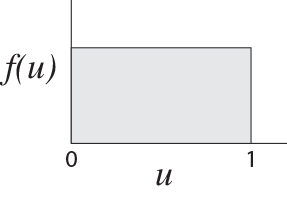
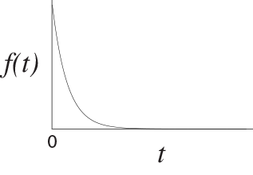
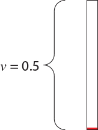
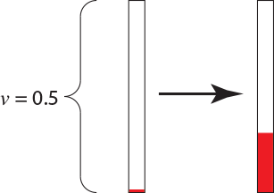
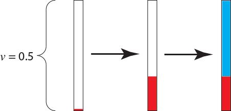

Basic Rev Commands
==============
{:.section}

In this tutorial, you will develop an intuition for continuous-time Markov models of the sort used by RevBayes, as well as by other programs, such as PAUP, MrBayes, PhyloBayes, and others.

Generating uniform and exponential random variables
---------------------------------------------------
{:.subsection}

If you had a highschool social life as awkward as this author's, you already own a 10-sided die (d10, in the gaming lingo). If you actually had friends in high school, however, you may need to buy such a die. Go to a gaming store and tell them that you want to buy a "d10." Alternatively, buy a 10-sided die from Amazon.

Examine your new die. Note that it has ten faces, with each face numbered from 0 to 9. You can generate a random number on the interval (0,1) by repeatedly rolling your die. You will assume the "0." of the number and use the die to randomly generate the digit in the tenths place (0.\_), hundreths place (0.\_ \_), thousandths place (0. \_ \_ \_) etc. until you have the random number to the desired precision. Let's try it! I rolled my die three times and saw, in order, the numbers 0, 4, and 7. My uniform(0,1) random number, then, is $u = 0.047$. Try it yourself. With three rolls of the die, you can generate a random number to a precision of three decimal places. Do you understand why the number you generate in this manner is uniformly-distributed on the interval (0,1)? For reference, the uniform(0,1) probability distribution looks like,

and is sometimes referred to as the rectangular distribution, for obvious reasons.

The uniform distribution is only one of many distributions. You have probably heard of at least some of the more common distributions (the normal, log-normal, binomial, gamma, Poisson, exponential, $\chi^2$, Student's t) and perhaps you've heard of some of the more obscure distributions, too  (Wishart, Normal inverse Wishart, and Weibull, among others). When simulating DNA sequence evolution on a tree, in addition to the uniform(0,1) random numbers, we will need to generate exponential random variables.

The exponential distribution is used to model waiting times. Imagine that something occurs at a constant rate, $\lambda$. The time until that something occurs is exponentially distributed with parameter $\lambda$. The exponential distribution looks like,

While we can use the die to generate a uniformly-distributed random number, we cannot directly generate an exponentially-distributed number. That said, we can generate an exponential random variable from our uniformly-distributed random number using some math. First, generate a uniform(0,1) random number using your die, called $u$. We can convert this uniform(0,1) random number to an exponential random number using the following equation:
$$
t = -{\log(u) \over \lambda} 
$$
where $\lambda$ is the rate at which something occurs and $\log$ is the natural log function. (You can access the natural log function on your smart phone by going to the calculator app and turning the phone on its side, thereby revealing the full functionality of the calculator.) The variable $t$ is exponentially distributed. 

Let's try it. We will generate an exponential random number when the rate parameter is $\lambda = 10$. With my die, I generated a uniform(0,1) random number: $u = 0.948$. Using my calculator, I convert it to an exponential random number:
$$
t = -{\log(0.948) \over 10} = 0.00534
$$

The parameters for the simulation
---------------------------------
{:.subsection}

We now have the machinery needed to generate uniform and exponential random numbers. For the simulation of DNA sequences on a tree, however, we need to choose some simulation parameters. Specifically, we need the tree topology, branch lengths, and rate matrix of the continuous-time Markov model that describes how the DNA sequences change over time.

We will assume the following tree for the simulations:

We will simulate on this tree for no particular reason except that I like this tree. Note the branch lengths on the tree. The branch lengths are in terms of expected number of substitutions per site. Again, the branch lengths were an arbitrary choice that I made. 

The last part of the model that must be specified is the rate matrix of the continuous-time Markov process that describes how the DNA sequences change on the tree. We will assume that sequences evolve according to the HKY85 model of DNA substitution, that has rate matrix:
$$
{\mathbf Q} = \{q_{ij}\} = \left( \begin{array}{cccc}
-               &  \pi_C & \kappa \pi_G & \pi_T \\
\pi_A & -               & \pi_G & \kappa \pi_T \\
\kappa \pi_A & \pi_C & -               & \pi_T \\
\pi_A & \kappa \pi_C & \pi_G & -               \\
\end{array} \right) \mu
$$
We will make a few important points about the rate matrix. First, the rate matrix may have free parameters. For example,
the HKY85 model has the parameters $\kappa$, $\pi_A$, $\pi_C$, $\pi_G$, and $\pi_T$. 
The parameter $\kappa$ is the transition/transversion rate bias; when $\kappa = 1$ transitions occur at the same rate as transversions.
Typically, the transition/transversion rate ratio, estimated using maximum likelihood or Bayesian inference, is
greater than one; transitions occur at a higher rate than transversions.
The other parameters -- $\pi_A$, $\pi_C$, $\pi_G$, and $\pi_T$ -- are the base frequencies, and have a biological interpretation
as the frequency of the different nucleotides and are also, incidentally, the stationary probabilities of the process.
Second, the rate matrix, ${\mathbf Q}$, can be used to calculate
the transition probabilities and the stationary distribution of the substitution process. The transition probabilities and
stationary distribution play a key role in calculating the likelihood.

We will assume the following values for the HKY85 parameters: $\kappa = 5$, $\pi_A = 0.4$, $\pi_C = 0.3$, $\pi_G = 0.2$, and $\pi_T = 0.1$.
These values result in the following scaled rate matrix:
$$
{\mathbf Q} = \{q_{ij}\} = \left( \begin{array}{rrrr}
-0.886 &  0.190 &  0.633 &  0.063 \\
 0.253 & -0.696 &  0.127 &  0.316 \\
 1.266 &  0.190 & -1.519 &  0.063 \\
 0.253 &  0.949 &  0.127 & -1.329 \\
\end{array} \right)
$$
The stationary probabilities for this rate matrix are $\pi_A = 0.4$, $\pi_C = 0.3$, $\pi_G = 0.2$, and $\pi_T = 0.1$.

Interpreting the rate matrix
----------------------------
{:.subsection}

The rate matrix specifies how changes occur on a phylogenetic tree. Consider the very simple case of a single
branch on a phylogenetic tree. Let's assume that the branch is $v=0.5$ in length. Our first task is to determine the nucleotide at the root of this tree. Although it is tempting to simply pick a nucleotide at the root of the tree with each nucleotide having a probability of $1/4$, doing so is not consistent with the process we are assuming, as described in the rate matrix, ${\mathbf Q}$. Rather, we should choose the state at the root of the tree from the stationary probabilities. I made four intervals, with the following probabilities:
$$
0.0 - 0.4 \rightarrow A \\
0.4 - 0.7 \rightarrow C \\
0.7 - 0.9 \rightarrow G \\
0.9 - 1.0 \rightarrow T
$$
I rolled the die to generate a uniiform(0,1) random number and obtained $u = 0.709$. The nucleotide at the root, then, is the nucleotide $G$.
The situation we have is something like this, 

in which we have a single branch of length $v = 0.5$ starting in the nucleotide $G$.
How can we simulate the evolution
of the site starting from the $G$ at the ancestor? The rate matrix tells us how to do this. First of all, because the current state of the process is $G$,  the only relevant row of the rate matrix is the third one:
$$
{\mathbf Q} = \{q_{ij}\} = \left( \begin{array}{cccc}
\cdot   &   \cdot &    \cdot &  \cdot \\
\cdot   &   \cdot &    \cdot &  \cdot \\
1.266 &  0.190 & -1.519 &  0.063 \\
\cdot   &   \cdot &    \cdot & \cdot \\
\end{array} \right)
$$
The overall rate of change away from nucleotide $G$ is $q_{GA} + q_{GC} + q_{GT} = 1.266 + 0.190 + 0.063 = 1.519$.
Equivalently, the rate of change away from nucleotide $G$ is simply $-q_{GG} = 1.519$. 
In a continuous-time Markov model, the waiting time between substitutions is exponentially distributed. 
The exact shape of the exponential distribution is determined by its rate, which is the same as the rate of the 
corresponding process in the ${\mathbf Q}$ matrix. For instance, if we are in state $G$, we  wait an exponentially
distributed amount of time with rate 1.519 until the next substitution occurs. 

I generated an exponential(1.519) random variable by first generating a uniform(0,1) random number with my die.
The first number it generated is $u = 0.794$. This means that the next time at which a substitution occurs is
0.152 up from the root of the tree [i.e., $t = -{1 \over 1.519} \log(0.152)$]. We can now color a portion of the branch because we know the process was in state $G$ from the root of the single-branch tree ($t=0.0$) to $t=0.152$:

The rate matrix also specifies the probabilities of a change from $G$
to the nucleotides $A$, $C$, and $T$.  These probabilities are
$$
\begin{array}{ccc}
G \rightarrow A: {1.266\over 1.519}=0.833, &  G \rightarrow C: {0.190\over 1.519}=0.125, & G \rightarrow T: {0.063 \over 1.519}=0.042 \\
\end{array} 
$$
To determine what nucleotide the process changes to we would generate another uniform(0,1) random number (again
called $u$). If $u$ is between 0 and 0.833, we will say that we had a change from $G$ to $A$. If the random number
is between 0.833 and 0.958 we will say that we had a change from $G$ to $C$. Finally, if the random number $u$ is
between 0.958 and 1.000, we will say we had a change from $G$ to $T$. The next number generated using the die
was $u = 0.102$, which means the change was from $G$ to $A$. The process is now in a different state (the nucleotide
$A$) and the relevant row of the rate matrix is
$$
{\mathbf Q} = \{q_{ij}\} = \left( \begin{array}{cccc}
-0.886 &  0.190 &  0.633 &  0.063 \\
\cdot & \cdot &  \cdot &  \cdot \\
\cdot &  \cdot & \cdot &  \cdot \\
\cdot &  \cdot &  \cdot & \cdot \\
\end{array} \right)
$$
We wait an exponentially distributed amount of time with parameter
$\lambda = 0.886$ until the next substitution occurs. When the substitution occurs, it is to a $C$, $G$, or $T$
with probabilities ${0.190 \over 0.886} = 0.214$, ${0.633 \over 0.886} = 0.714$, and ${0.063 \over 0.886} = 0.072$,
respectively. 

This process of generating random and exponentially-distributed times until the next substitution occurs
and then determining (randomly) what nucleotide the change is to is repeated until the process exceeds the length
of the branch. The state the process is in when it passes the end of the branch is recorded. To complete the simulation on the branch, I generated another uniform random variable using the die. The number was $u = 0.371$, which means that the next substitution would occur 1.119 units above the substitution
from $G \rightarrow A$. The process is in the state $A$ when it passed the end of the branch:

The only non-random part of the entire procedure was the initial choice of the parameters. All other aspects of the simulation used a uniform random number generator
and our knowledge of the rate matrix to simulate a single realization of the HKY85 process of DNA substitution. 

Simulating on a more complicated tree
-------------------------------------
{:.subsection}

Simulating on the tree

is only slightly more complicated than simulating data on the single-branch tree. The steps are as follows:

- First, generate the state at the root of the tree. This step requires knowledge of the stationary probabilities for the Markov process specified by the rate matrix, ${\mathbf Q}$. The stationary distribution is the probability of capturing the process in a particular state when it has been run for a very long (technically, infinitely long) time. The stationary probabilities for the rate matrix we chose are $\pi_A = 0.4$, $\pi_C = 0.3$, $\pi_G = 0.2$, and $\pi_T = 0.1$. 
- Visit each branch in turn in preorder sequence (that is, from the root to the tips of the tree). If you visit the branches in preorder sequence, you will know the state at the root of the branch.

Pattern probabilities
---------------------
{:.subsection}

The tree we simulate DNA sequence evolution on has only four tips. This means that there are a total of $4^4 = 256$ possible patterns of nucleotides we could have observed at the tips of the tree. For example, one of the possible patterns is GTTC: Species I has the nucletide G, Species II and Species III are assigned the nucleotide T, and Species IV is assigned C.

The probability of simulating any of the 256 patterns is given in the following table:

|Pattern | Prob. | Pattern | Prob. | Pattern | Prob. | Pattern | Prob. |
|------|----------|------|----------|------|----------|------|----------|
| AAAA | 0.199465 | AGAA | 0.014711 | CAAA | 0.018317 | CGAA | 0.001490 |
| AAAC | 0.004185 | AGAC | 0.000725 | CAAC | 0.000628 | CGAC | 0.000210 |
| AAAG | 0.014711 | AGAG | 0.019868 | CAAG | 0.001490 | CGAG | 0.002878 |
| AAAT | 0.001395 | AGAT | 0.000242 | CAAT | 0.000166 | CGAT | 0.000048 |
| AACA | 0.009075 | AGCA | 0.000843 | CACA | 0.005277 | CGCA | 0.000669 |
| AACC | 0.000703 | AGCC | 0.000315 | CACC | 0.004524 | CGCC | 0.002262 |
| AACG | 0.000843 | AGCG | 0.002202 | CACG | 0.000669 | CGCG | 0.002304 |
| AACT | 0.000121 | AGCT | 0.000048 | CACT | 0.000375 | CGCT | 0.000188 |
| AAGA | 0.028625 | AGGA | 0.005985 | CAGA | 0.003304 | CGGA | 0.001065 |
| AAGC | 0.000702 | AGGC | 0.000755 | CAGC | 0.000210 | CGGC | 0.000209 |
| AAGG | 0.005985 | AGGG | 0.032738 | CAGG | 0.001065 | CGGG | 0.006655 |
| AAGT | 0.000234 | AGGT | 0.000252 | CAGT | 0.000048 | CGGT | 0.000059 |
| AATA | 0.003025 | AGTA | 0.000281 | CATA | 0.000959 | CGTA | 0.000120 |
| AATC | 0.000121 | AGTC | 0.000048 | CATC | 0.000360 | CGTC | 0.000180 |
| AATG | 0.000281 | AGTG | 0.000734 | CATG | 0.000120 | CGTG | 0.000420 |
| AATT | 0.000154 | AGTT | 0.000073 | CATT | 0.000404 | CGTT | 0.000202 |
| ACAA | 0.004185 | ATAA | 0.001395 | CCAA | 0.000628 | CTAA | 0.000166 |
| ACAC | 0.005482 | ATAC | 0.000350 | CCAC | 0.009592 | CTAC | 0.000415 |
| ACAG | 0.000725 | ATAG | 0.000242 | CCAG | 0.000210 | CTAG | 0.000048 |
| ACAT | 0.000350 | ATAT | 0.001594 | CCAT | 0.000415 | CTAT | 0.001214 |
| ACCA | 0.000703 | ATCA | 0.000121 | CCCA | 0.004524 | CTCA | 0.000375 |
| ACCC | 0.019527 | ATCC | 0.000752 | CCCC | 0.167489 | CTCC | 0.005866 |
| ACCG | 0.000315 | ATCG | 0.000048 | CCCG | 0.002262 | CTCG | 0.000188 |
| ACCT | 0.000752 | ATCT | 0.001546 | CCCT | 0.005866 | CTCT | 0.007452 |
| ACGA | 0.000702 | ATGA | 0.000234 | CCGA | 0.000210 | CTGA | 0.000048 |
| ACGC | 0.001837 | ATGC | 0.000116 | CCGC | 0.004796 | CTGC | 0.000208 |
| ACGG | 0.000755 | ATGG | 0.000252 | CCGG | 0.000209 | CTGG | 0.000059 |
| ACGT | 0.000116 | ATGT | 0.000535 | CCGT | 0.000208 | CTGT | 0.000607 |
| ACTA | 0.000121 | ATTA | 0.000154 | CCTA | 0.000360 | CTTA | 0.000404 |
| ACTC | 0.001781 | ATTC | 0.000517 | CCTC | 0.011625 | CTTC | 0.001716 |
| ACTG | 0.000048 | ATTG | 0.000073 | CCTG | 0.000180 | CTTG | 0.000202 |
| ACTT | 0.000517 | ATTT | 0.004711 | CCTT | 0.001716 | CTTT | 0.013873 |
| GAAA | 0.045565 | GGAA | 0.005060 | TAAA | 0.006106 | TGAA | 0.000497 |
| GAAC | 0.001004 | GGAC | 0.000453 | TAAC | 0.000166 | TGAC | 0.000048 |
| GAAG | 0.005060 | GGAG | 0.017648 | TAAG | 0.000497 | TGAG | 0.000959 |
| GAAT | 0.000335 | GGAT | 0.000151 | TAAT | 0.000099 | TGAT | 0.000038 |
| GACA | 0.002514 | GGCA | 0.000532 | TACA | 0.000959 | TGCA | 0.000120 |
| GACC | 0.000315 | GGCC | 0.000194 | TACC | 0.000548 | TGCC | 0.000274 |
| GACG | 0.000532 | GGCG | 0.002904 | TACG | 0.000120 | TGCG | 0.000420 |
| GACT | 0.000048 | GGCT | 0.000036 | TACT | 0.000215 | TGCT | 0.000108 |
| GAGA | 0.014437 | GGGA | 0.008240 | TAGA | 0.001101 | TGGA | 0.000355 |
| GAGC | 0.000476 | GGGC | 0.001251 | TAGC | 0.000048 | TGGC | 0.000059 |
| GAGG | 0.008240 | GGGG | 0.056794 | TAGG | 0.000355 | TGGG | 0.002218 |
| GAGT | 0.000159 | GGGT | 0.000417 | TAGT | 0.000038 | TGGT | 0.000030 |
| GATA | 0.000838 | GGTA | 0.000177 | TATA | 0.001119 | TGTA | 0.000143 |
| GATC | 0.000048 | GGTC | 0.000036 | TATC | 0.000231 | TGTC | 0.000116 |
| GATG | 0.000177 | GGTG | 0.000968 | TATG | 0.000143 | TGTG | 0.000488 |
| GATT | 0.000073 | GGTT | 0.000040 | TATT | 0.000893 | TGTT | 0.000447 |
| GCAA | 0.001004 | GTAA | 0.000335 | TCAA | 0.000166 | TTAA | 0.000099 |
| GCAC | 0.001837 | GTAC | 0.000116 | TCAC | 0.001389 | TTAC | 0.000240 |
| GCAG | 0.000453 | GTAG | 0.000151 | TCAG | 0.000048 | TTAG | 0.000038 |
| GCAT | 0.000116 | GTAT | 0.000535 | TCAT | 0.000240 | TTAT | 0.002009 |
| GCCA | 0.000315 | GTCA | 0.000048 | TCCA | 0.000548 | TTCA | 0.000215 |
| GCCC | 0.009764 | GTCC | 0.000376 | TCCC | 0.019456 | TTCC | 0.001275 |
| GCCG | 0.000194 | GTCG | 0.000036 | TCCG | 0.000274 | TTCG | 0.000108 |
| GCCT | 0.000376 | GTCT | 0.000773 | TCCT | 0.001275 | TTCT | 0.006924 |
| GCGA | 0.000476 | GTGA | 0.000159 | TCGA | 0.000048 | TTGA | 0.000038 |
| GCGC | 0.001823 | GTGC | 0.000117 | TCGC | 0.000694 | TTGC | 0.000120 |
| GCGG | 0.001251 | GTGG | 0.000417 | TCGG | 0.000059 | TTGG | 0.000030 |
| GCGT | 0.000117 | GTGT | 0.000530 | TCGT | 0.000120 | TTGT | 0.001005 |
| GCTA | 0.000048 | GTTA | 0.000073 | TCTA | 0.000231 | TTTA | 0.000893 |
| GCTC | 0.000891 | GTTC | 0.000258 | TCTC | 0.004935 | TTTC | 0.003240 |
| GCTG | 0.000036 | GTTG | 0.000040 | TCTG | 0.000116 | TTTG | 0.000447 |
| GCTT | 0.000258 | GTTT | 0.002355 | TCTT | 0.003240 | TTTT | 0.031522 |

---

Exercises
------------------
{:.subsection}

Simulate a site on the four-species tree described in this lab using the rate matrix.
$$
{\mathbf Q} = \{q_{ij}\} = \left( \begin{array}{rrrr}
-0.886 &  0.190 &  0.633 &  0.063 \\
 0.253 & -0.696 &  0.127 &  0.316 \\
 1.266 &  0.190 & -1.519 &  0.063 \\
 0.253 &  0.949 &  0.127 & -1.329 \\
\end{array} \right)
$$

Why do we start the simulation by drawing from the stationary distribution?

