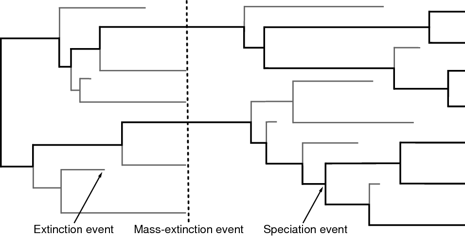
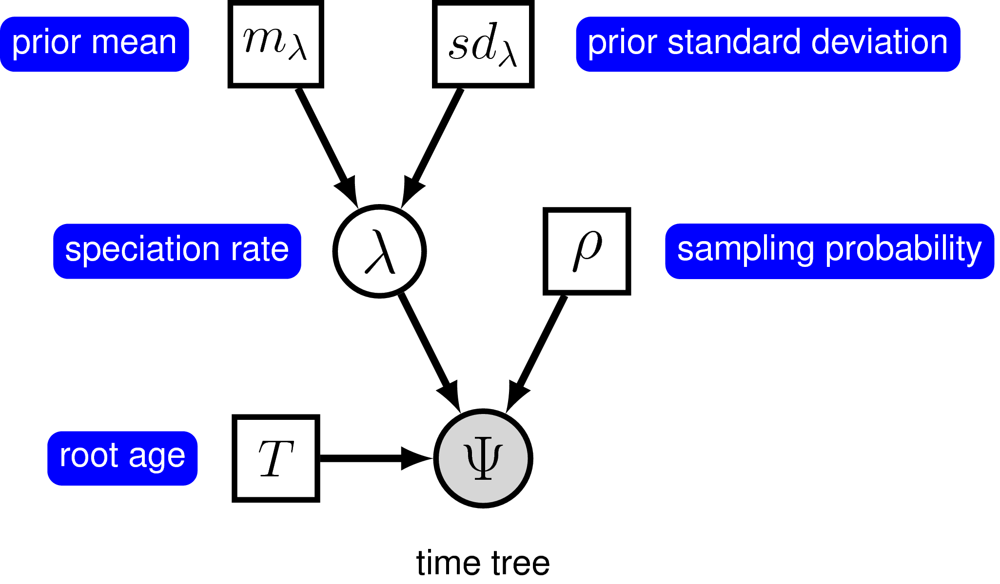
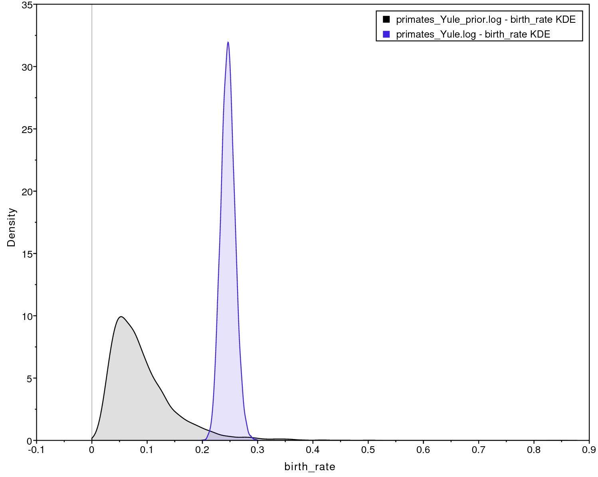
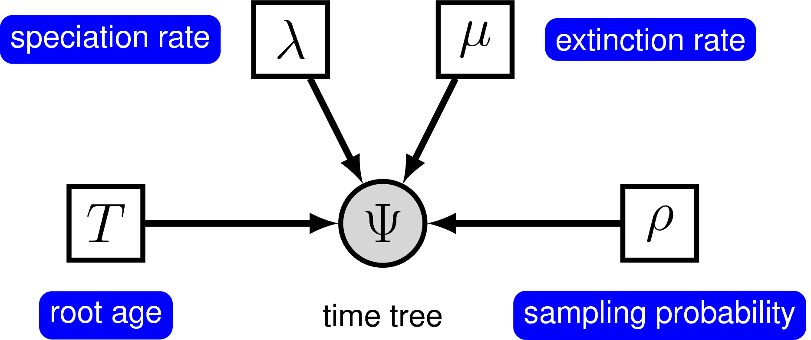
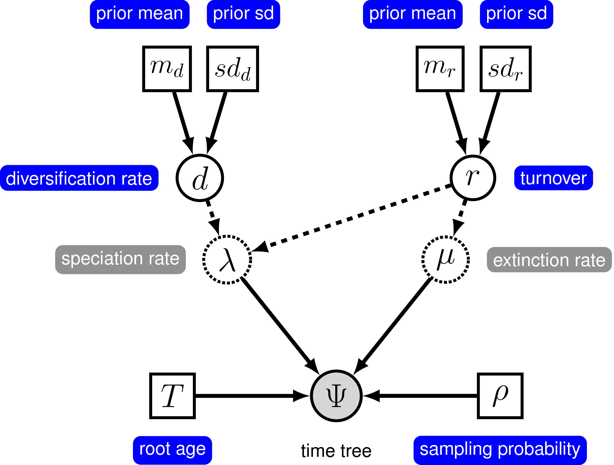

Overview: Diversification Rate Estimation {#sec:diversification_rate_overview}
=========================================
{:.section}

Models of speciation and extinction are fundamental to any phylogenetic
analysis of macroevolutionary processes
(*e.g.,* divergence time estimation,
diversification rate estimation, continuous and discrete trait
evolution, and historical biogeography). First, a prior model describing
the distribution of speciation events over time is critical to
estimating phylogenies with branch lengths proportional to time. Second,
stochastic branching models allow for inference of speciation and
extinction rates. These inferences allow us to investigate key questions
in evolutionary biology.

Diversification-rate parameters may be included as nuisance parameters
of other phylogenetic models—*i.e.*,  where
these diversification-rate parameters are not of direct interest. For
example, many methods for estimating species divergence times—such as
`BEAST` ,
`MrBayes` , and
`RevBayes` —implement 'relaxed-clock models'
that include a constant-rate birth-death branching process as a prior
model on the distribution of tree topologies and node ages. Although the
parameters of these 'tree priors' are not typically of direct interest,
they are nevertheless estimated as part of the joint posterior
probability distribution of the relaxed-clock model, and so can be
estimated simply by querying the corresponding marginal posterior
probability densities. In fact, this may provide more robust estimates
of the diversification-rate parameters, as they accommodate uncertainty
in the other phylogenetic-model parameters (including the tree topology,
divergence-time estimates, and the other relaxed-clock model
parameters). More recent work,
*e.g.*, , uses macroevolutionary
models (the fossilized birth-death process) to calibrate phylogenies and
thus to infer dated trees.

In these tutorials we focus on the different types of macroevolutionary
models to study diversification processes and thus the
diversification-rate parameters themselves. Nevertheless, these
macroevolutionary models should be used for other evolutionary
questions, when an appropriate prior distribution on the tree and
divergence times is needed.

Types of Hypotheses for Estimating Diversification Rates
--------------------------------------------------------

Many evolutionary phenomena entail differential rates of diversification
(speciation – extinction); *e.g.,* adaptive
radiation, diversity-dependent diversification, key innovations, and
mass extinction. The specific study questions regarding lineage
diversification may be classified within three fundamental categories of
inference problems. Admittedly, this classification scheme is somewhat
arbitrary, but it is nevertheless useful, as it allows users to navigate
the ever-increasing number of available phylogenetic methods. Below, we
describe each of the fundamental questions regarding diversification
rates.

#### (1) Diversification-rate through time estimation

*What is the (constant) rate of diversification in my study group?* The
most basic models estimate parameters of the stochastic-branching
process (*i.e.*,  rates of speciation and
extinction, or composite parameters such as net-diversification and
relative-extinction rates) under the assumption that rates have remained
constant across lineages and through time;
*i.e.*,  under a constant-rate birth-death
stochastic-branching process model . Extensions to the
(basic) constant-rate models include diversification-rate variation
through time . First, we might ask whether
there is evidence of an episodic, tree-wide increase in diversification
rates (associated with a sudden increase in speciation rate and/or
decrease in extinction rate), as might occur during an episode of
adaptive radiation. A second question asks whether there is evidence of
a continuous/gradual decrease in diversification rates through time
(associated with decreasing speciation rates and/or increasing
extinction rates), as might occur because of diversity-dependent
diversification (*i.e.*,  where competitive
ecological interactions among the species of a growing tree decrease the
opportunities for speciation and/or increase the probability of
extinction, *e.g.,* ). Third, we
can ask whether changes in diversification rates are correlated with
environmental factors, such as environmental CO2 or temperature
. A final question in this category asks whether our
study tree was impacted by a mass-extinction event (where a large
fraction of the standing species diversity is suddenly lost,
*e.g.,* ). The common theme of these
studies is that the diversification process is tree-wide, that is, all
lineages of the study group have the exact same rates at a given time.

#### (2) Diversification-rate variation across branches estimation

*Is there evidence that diversification rates have varied significantly
across the branches of my study group?* Models have been developed to
detect departures from rate constancy across lineages; these tests are
analogous to methods that test for departures from a molecular
clock—*i.e.*,  to assess whether substitution
rates vary significantly across lineages .
These models are important for assessing whether a given tree violates
the assumptions of rate homogeneity among lineages. Furthermore, these
models are important to answer questions such as: *What are the
branch-specific diversification rates?*; and *Have there been
significant diversification-rate shifts along branches in my study
group, and if so, how many shifts, what magnitude of rate-shifts and
along which branches?*

#### (3) Character-dependent diversification-rate estimation

*Are diversification rates correlated with some variable in my study
group?* Character-dependent diversification-rate models aim to identify
overall correlations between diversification rates and organismal
features (binary and multi-state discrete morphological traits,
continuous morphological traits, geographic range, etc.). For example,
one can hypothesize that a binary character, say if an organism is
herbivorous/carnivorous or self-compatible/self-incompatible, impact the
diversification rates. Then, if the organism is in state 0
(*e.g.,* is herbivorous) it has a lower (or
higher) diversification rate than if the organism is in state 1
(*e.g.,* carnivorous) .

Diversification Rate Models {#sec:models}
===========================
{:.section}

We begin this section with a general introduction to the stochastic
birth-death branching process that underlies inference of
diversification rates in RevBayes. This primer will
provide some details on the relevant theory of stochastic-branching
process models. We appreciate that some readers may want to skip this
somewhat technical primer; however, we believe that a better
understanding of the relevant theory provides a foundation for
performing better inferences. We then discuss a variety of specific
birth-death models, but emphasize that these examples represent only a
tiny fraction of the possible diversification-rate models that can be
specified in RevBayes.

The birth-death branching process
---------------------------------

Our approach is based on the *reconstructed evolutionary process*
described by ; a birth-death process in which only sampled,
extant lineages are observed. Let $N(t)$ denote the number of species at
time $t$. Assume the process starts at time $t_1$ (the 'crown' age of
the most recent common ancestor of the study group, $t_\text{MRCA}$)
when there are two species. Thus, the process is initiated with two
species, $N(t_1) = 2$. We condition the process on sampling at least one
descendant from each of these initial two lineages; otherwise $t_1$
would not correspond to the $t_\text{MRCA}$ of our study group. Each
lineage evolves independently of all other lineages, giving rise to
exactly one new lineage with rate $b(t)$ and losing one existing lineage
with rate $d(t)$ (Figure [fig:BirthDeathShift] and
Figure [fig:BDP]). Note that although each lineage evolves
independently, all lineages share both a common (tree-wide) speciation
rate $b(t)$ and a common extinction rate $d(t)$
{% citet Nee1994b } {% citet Hoehna2015a }. Additionally, at certain times,
$t_{\mathbb{M}}$, a mass-extinction event occurs and each species
existing at that time has the same probability, $\rho$, of survival.
Finally, all extinct lineages are pruned and only the reconstructed tree
remains (Figure [fig:BirthDeathShift]).

> A realization of the birth-death process with mass extinction. 
> Lineages that have no extant or sampled descendant are shown in gray and
> surviving lineages are shown in a thicker black line.

> **Examples of trees produced under a birth-death
> process.** The process is initiated at the first speciation event (the 'crown-age' of the MRCA)
> when there are two initial lineages. At each speciation event the ancestral lineage is replaced by two
> descendant lineages. At an extinction event one lineage simply
> terminates. (A) A complete tree including extinct lineages. (B) The
> reconstructed tree of tree from A with extinct lineages pruned away. (C)
> A *uniform* subsample of the tree from B, where each species was sampled
> with equal probability, $\rho$. (D) A *diversified* subsample of the
> tree from B, where the species were selected so as to maximize
> diversity.

To condition the probability of observing the branching times on the
survival of both lineages that descend from the root, we divide by
$P(N(T) > 0 | N(0) = 1)^2$. Then, the probability density of the
branching times, $\mathbb{T}$, becomes 

$$\begin{aligned}
P(\mathbb{T}) = \fra\frac{{}{b}ace{P(N(T) = 1 \mid N(0) = 1)^2}^{\text{both initial lineages have one descendant}}}{ \underbrace{P(N(T) > 0 \mid N(0) = 1)^2}_{\text{both initial lineages survive}} } \times \prod_{i=2}^{n-1\frac{ }{b}ace{i \times b(t_i)}^{\text{speciation rate}} \time\frac{ }{b}ace{P(N(T) = 1 \mid N(t_i) = 1)}^\text{lineage has one descendant},\end{aligned}$$
and the probability density of the reconstructed tree (topology and
branching times) is then $$\begin{aligned}
P(\Psi) = \; & \frac{2^{n-1}}{n!(n-1)!} \times \left( \frac{P(N(T) = 1 \mid N(0) = 1)}{P(N(T) > 0 \mid N(0) = 1)} \right)^2 \nonumber\\
		  \; & \times \prod_{i=2}^{n-1} i \times b(t_i) \times P(N(T) = 1 \mid N(t_i) = 1)
	\label{eq:tree_probability}\end{aligned}$$

We can expand Equation ([eq:tree_probability]) by substituting
$P(N(T) > 0 \mid N(t) =1)^2 \exp(r(t,T))$ for
$P(N(T) = 1 \mid N(t) = 1)$, where $r(u,v) = \int^v_u d(t)-b(t)dt$; the
above equation becomes $$\begin{aligned}
P(\Psi) = \; & \frac{2^{n-1}}{n!(n-1)!} \times \left( \frac{P(N(T) > 0 \mid N(0) =1 )^2 \exp(r(0,T))}{P(N(T) > 0 \mid N(0) = 1)} \right)^2 \nonumber\\
		  \; & \times \prod_{i=2}^{n-1} i \times b(t_i) \times P(N(T) > 0 \mid N(t_i) = 1)^2 \exp(r(t_i,T)) \nonumber\\
		= \; & \frac{2^{n-1}}{n!} \times \Big(P(N(T) > 0 \mid N(0) =1 ) \exp(r(0,T))\Big)^2 \nonumber\\
		  \; & \times \prod_{i=2}^{n-1} b(t_i) \times P(N(T) > 0 \mid N(t_i) = 1)^2 \exp(r(t_i,T)).
		\label{eq:tree_probability_substitution}\end{aligned}$$ For a detailed
description of this substitution, see @Hoehna2015a. Additional
information regarding the underlying birth-death process can be found in
@Thompson1975 [Equation 3.4.6] and @Nee1994b for constant rates and
@Hoehna2013 {% cite Hoehna2014a}  for arbitrary rate functions.

To compute the equation above we need to know the rate function,
$r(t,s) = \int_t^s d(x)-b(x) dx$, and the probability of survival,
$P(N(T)\!>\!0|N(t)\!=\!1)$. @Yule1925 and later @Kendall1948 derived the
probability that a process survives ($N(T) > 0$) and the probability of
obtaining exactly $n$ species at time $T$ ($N(T) = n$) when the process
started at time $t$ with one species. Kendall's results were summarized
in Equation (3) and Equation (24) in @Nee1994b $$\begin{aligned}
P(N(T)\!>\!0|N(t)\!=\!1) & = & \left(1+\int\limits_t^{T} \bigg(\mu(s) \exp(r(t,s))\bigg) ds\right)^{-1} \label{eq:survival} \\ \nonumber \\
P(N(T)\!=\!n|N(t)\!=\!1) & = & (1-P(N(T)\!>\!0|N(t)\!=\!1)\exp(r(t,T)))^{n-1} \nonumber\\
& & \times P(N(T)\!>\!0|N(t)\!=\!1)^2 \exp(r(t,T)) \label{eq:N} $$ An
overview for different diversification models is given in @Hoehna2015a.

> ## Phylogenetic trees as observations
> The branching processes used here describe probability distributions on
> phylogenetic trees. This probability distribution can be used to infer
> diversification rates given an “observed” phylogenetic tree. In reality
> we never observe a phylogenetic tree itself. Instead, phylogenetic trees
> themselves are estimated from actual observations, such as DNA
> sequences. These phylogenetic tree estimates, especially the divergence
> times, can have considerable uncertainty associated with them. Thus, the
> correct approach for estimating diversification rates is to include the
> uncertainty in the phylogeny by, for example, jointly estimating the
> phylogeny and diversification rates. For the simplicity of the following
> tutorials, we take a shortcut and assume that we know the phylogeny
> without error. For publication quality analysis you should always
> estimate the diversification rates jointly with the phylogeny and
> divergence times.
{:.discussion}

Estimating Constant Speciation & Extinction Rates
=================================================
{:.section}

Outline
-------

This tutorial describes how to specify basic branching-process models in
RevBayes; two variants of the constant-rate birth-death process
.
The probabilistic graphical model is given for each component of this
tutorial. After each model is specified, you will estimate speciation
and extinction rates using Markov chain Monte Carlo (MCMC). Finally, you
will estimate the marginal likelihood of the model and evaluate the
relative support using Bayes factors.

Pure-Birth (Yule) Model {#yuleModSec}
=======================
{:.section}

Before evaluating the relative support for different models, we must
first specify them in `Rev`. In this section, we will walk through
specifying a pure-birth process model and estimating the marginal
likelihood. The section about the birth-death process will be less
detailed because it will build up on this section.

The simplest branching model is the *pure-birth process* described by
. Under this model, we assume at any instant in time, every
lineage has the same speciation rate, $\lambda$. In its simplest form,
the speciation rate remains constant over time. As a result, the waiting
time between speciation events is exponential, where the rate of the
exponential distribution is the product of the number of extant lineages
($n$) at that time and the speciation rate: $n\lambda$
{% cite Yule1925} {% cite Aldous2001} . The pure-birth branching model
does not allow for lineage extinction
(*i.e.*, the extinction rate $\mu=0$). However,
the model depends on a second parameter, $\rho$, which is the
probability of sampling a species in the present time. It also depends
on the time of the start of the process, whether that is the origin time
or root age. Therefore, the probabilistic graphical model of the
pure-birth process is quite simple, where the observed time tree
topology and node ages are conditional on the speciation rate, sampling
probability, and root age (Fig. [fig:yule_gm]).

 
> The graphical model representation of
the pure-birth (Yule) process.

We can add hierarchical structure to this model and account for
uncertainty in the value of the speciation rate by placing a hyperprior
on $\lambda$ (Fig. [fig:yule_gm2]). The graphical models in Figures
[fig:yule_gm] and [fig:yule_gm2] demonstrate the simplicity of the
Yule model. Ultimately, the pure birth model is just a special case of
the birth-death process, where the extinction rate (typically denoted
$\mu$) is a constant node with the value 0.

 
> The graphical model representation
of the pure-birth (Yule) process, where the speciation rate is treated
as a random variable drawn from a lognormal distribution.

For this exercise, we will specify a Yule model, such that the
speciation rate is a stochastic node, drawn from a lognormal
distribution as in Figure [fig:yule_gm2]. In a Bayesian framework, we
are interested in estimating the posterior probability of $\lambda$
given that we observe a time tree. $$\begin{aligned}
\label{bayesTher}
\mathbb{P}(\lambda \mid \Psi) &= \frac{\mathbb{P}(\Psi \mid \lambda)\mathbb{P}(\lambda \mid \nu)}{\mathbb{P}(\Psi)}\end{aligned}$$
In this example, we have a phylogeny of 233 primates. We are treating
the time tree $\Psi$ as an observation, thus clamping the model with an
observed value. The time tree we are conditioning the process on is
taken from the analysis by @MagnusonFord2012. Furthermore, there are
approximately 367 described primates species, so we will fix the
parameter $\rho$ to $233/367$.

-   The full Yule-model specification is in the file called
    [`Yule.Rev`](https://github.com/revbayes/revbayes_tutorial/raw/master/RB_DiversificationRate_Tutorial/RevBayes_scripts/Yule.Rev)
    on the RevBayes tutorial repository.\

Read the tree
-------------

Begin by reading in the observed tree.

    T <- readTrees("data/primates_tree.nex")[1]

From this tree, we can get some helpful variables:

    taxa <- T.taxa()

Additionally, we can initialize an iterator variable for our vector of
moves:

    mvi = 0
    mni = 0

Specifying the model
--------------------

### Birth rate

The model we are specifying only has three nodes
(Fig. [fig:yule_gm2]). We can specify the birth rate $\lambda$, the
mean and standard deviation of the lognormal hyperprior on $\lambda$,
and the conditional dependency of the two parameters all in one line of
`Rev` code.

    birth_rate_mean <- ln( ln(367/2) / T.rootAge() )
    birth_rate_sd <- 0.587405
    birth_rate ~ dnLognormal(mean=birth_rate_mean,sd=birth_rate_sd)

Here, the stochastic node called `birth_rate` represents the speciation
rate $\lambda$. `birth_rate_mean` and `birth_rate_sd` are the prior
mean and prior standard deviation, respectively. We chose the prior mean
so that it is centered around observed number of species
(*i.e.*, the expected number of species under a
Yule process will thus be equal to the observed number of species) and a
prior standard deviation of 0.587405 which creates a lognormal
distribution with 95% prior probability spanning exactly one order of
magnitude. If you want to represent more prior uncertainty by,
*e.g.,*allowing for two orders of magnitude in
the 95% prior probability then you can simply multiply `birth_rate_sd`
by a factor of 2.

To estimate the value of $\lambda$, we assign a proposal mechanism to
operate on this node. In RevBayes these MCMC sampling algorithms are
called *moves*. We need to create a vector of moves and we can do this
by using vector indexing and our pre-initialized iterator `mi`. We will
use a scaling move on $\lambda$ called `mvScale`.

    moves[++mvi] = mvScale(birth_rate,lambda=1,tune=true,weight=3)

### Sampling probability

Our prior belief is that we have sampled 233 out of 367 living primate
species. To account for this we can set the sampling parameter as a
constant node with a value of 233/367

    rho <- T.ntips()/367

### Root age

Any stochastic branching process must be conditioned on a time that
represents the start of the process. Typically, this parameter is the
*origin time* and it is assumed that the process started with *one*
lineage. Thus, the origin of a birth-death process is the node that is
*ancestral* to the root node of the tree. For macroevolutionary data,
particularly without any sampled fossils, it is difficult to use the
origin time. To accommodate this, we can condition on the age of the
root by assuming the process started with *two* lineages that both
originate at the time of the root.

We can get the value for the root from the @MagnusonFord2012 tree.

    root_time <- T.rootAge()

### The time tree

Now we have all of the parameters we need to specify the full pure-birth
model. We can initialize the stochastic node representing the time tree.
Note that we set the `mu` parameter to the constant value `0.0`.

    timetree ~ dnBDP(lambda=birth_rate, mu=0.0, rho=rho, rootAge=root_time, samplingStrategy="uniform", condition="survival", taxa=taxa)

If you refer back to Equation [bayesTher] and Figure
[fig:yule_gm2], the time tree $\Psi$ is the variable we observe,
*i.e.*, the data. We can set this in `Rev` by
using the `clamp()` function.

    timetree.clamp(T)

Here we are fixing the value of the time tree to our observed tree from
@MagnusonFord2012.

Finally, we can create a workspace object of our whole model using the
`model()` function. Workspace objects are initialized using the `=`
operator. This distinguishes the objects used by the program to run the
MCMC analysis from the distinct nodes of our graphical model. The model
workspace objects makes it easy to work with the model in `Rev` and
creates a wrapper around our model DAG. Because our model is a directed,
acyclic graph (DAG), we only need to give the model wrapper function a
single node and it does the work to find all the other nodes through
their connections.

    mymodel = model(birth_rate)

The `model()` function traverses all of the connections and finds all of
the nodes we specified.

Running an MCMC analysis
------------------------

### Specifying Monitors

For our MCMC analysis, we need to set up a vector of *monitors* to
record the states of our Markov chain. The monitor functions are all
called `mn\*`, where `\*` is the wildcard representing the monitor type.
First, we will initialize the model monitor using the `mnModel`
function. This creates a new monitor variable that will output the
states for all model parameters when passed into a MCMC function.

    monitors[++mni] = mnModel(filename="output/primates_Yule.log",printgen=10, separator = TAB)

Additionally, create a screen monitor that will report the states of
specified variables to the screen with `mnScreen`:

    monitors[++mni] = mnScreen(printgen=1000, birth_rate)

### Initializing and Running the MCMC Simulation

With a fully specified model, a set of monitors, and a set of moves, we
can now set up the MCMC algorithm that will sample parameter values in
proportion to their posterior probability. The `mcmc()` function will
create our MCMC object:

    mymcmc = mcmc(mymodel, monitors, moves)

We may wish to run the `.burnin()` member function,
*i.e.*, if we wish to pre-run the chain and
discard the initial states. Recall that the `.burnin()` function
specifies a *completely separate* preliminary MCMC analysis that is used
to tune the scale of the moves to improve mixing of the MCMC analysis.

    mymcmc.burnin(generations=10000,tuningInterval=200)

Now, run the MCMC:

    mymcmc.run(generations=50000)

When the analysis is complete, you will have the monitored files in your
output directory.

The `Rev` file for performing this analysis:
[`mcmc_Yule.Rev`](https://github.com/revbayes/revbayes_tutorial/raw/master/RB_DiversificationRate_Tutorial/RevBayes_scripts/mcmc_Yule.Rev).

Exercise 1
----------
{:.subsection}

-   Run an MCMC simulation to estimate the posterior distribution of the
    speciation rate (`birth_rate`).

-   Load the generated output file into `Tracer`: What is
    the mean posterior estimate of the `birth_rate` and what is the
    estimated HPD?

-   Compare the prior mean with the posterior mean. (**Hint:** Use the
    optional argument `underPrior=TRUE` in the function `mymcmc.run()`)
    Are they different
    (*e.g.,*Figure [fig:prior_posterior])?
    Is the posterior mean outside the prior 95% probability interval?

-   Repeat the analysis and allow for two orders of magnitude of
    prior uncertainty.

 
> Estimates of the
posterior and prior distribution of the `birth_rate` visualized in
`Tracer`. The prior (black curve) shows the lognormal
distribution that we chose as the prior distribution.

Estimating the marginal likelihood of the model
===============================================

With a fully specified model, we can set up the `powerPosterior()`
analysis to create a file of 'powers' and likelihoods from which we can
estimate the marginal likelihood using stepping-stone or path sampling.
This method computes a vector of powers from a beta distribution, then
executes an MCMC run for each power step while raising the likelihood to
that power. In this implementation, the vector of powers starts with 1,
sampling the likelihood close to the posterior and incrementally
sampling closer and closer to the prior as the power decreases. For more
information on marginal likelihood estimation please read the
[RB_BayesFactor_Tutorial](https://github.com/revbayes/revbayes_tutorial/raw/master/tutorial_TeX/RB_BayesFactor_Tutorial/RB_BayesFactor_Tutorial.pdf).

First, we create the variable containing the power posterior. This
requires us to provide a model and vector of moves, as well as an output
file name. The `cats` argument sets the number of power steps.

    pow_p = powerPosterior(mymodel, moves, monitors, "output/Yule_powp.out", cats=100, sampleFreq=10)

We can start the power posterior by first burning in the chain and and
discarding the first 10000 states.

    pow_p.burnin(generations=10000,tuningInterval=200)

Now execute the run with the `.run()` function:

    pow_p.run(generations=10000)

Once the power posteriors have been saved to file, create a
stepping-stone sampler. This function can read any file of power
posteriors and compute the marginal likelihood using stepping-stone
sampling.

    ss = steppingStoneSampler(file="output/Yule_powp.out", powerColumnName="power", likelihoodColumnName="likelihood")

Compute the marginal likelihood under stepping-stone sampling using the
member function `marginal()` of the `ss` variable and record the value
in Table [ssTable].

    ss.marginal()

Path sampling is an alternative to stepping-stone sampling and also
takes the same power posteriors as input.

    ps = pathSampler(file="output/Yule_powp.out", powerColumnName="power", likelihoodColumnName="likelihood")

Compute the marginal likelihood under stepping-stone sampling using the
member function `marginal()` of the `ps` variable and record the value
in Table [ssTable].

    ps.marginal()

The `Rev` file for performing this analysis: `ml_Yule.Rev`.

Exercise 2
----------
{:.subsection}
-   Compute the marginal likelihood under the Yule model.

-   Enter the estimate in the table below.

l c c c c & & & &\
Marginal likelihood Yule ($M_0$) &

& &

&\
Marginal likelihood birth-death ($M_1$) &

& &

&\
Supported model? &

& &

&\
\

[ssTable]

Birth-Death Process {#birthDeathSec}
===================
{:.section}

The pure-birth model does not account for extinction, thus it assumes
that every lineage at the start of the process will have sampled
descendants at time 0. This assumption is fairly unrealistic for most
phylogenetic datasets on a macroevolutionary time scale since the fossil
record provides evidence of extinct lineages.  described a
more general branching process model to account for lineage extinction
called the *birth-death process*. Under this model, at any instant in
time, every lineage has the same rate of speciation $\lambda$ and the
same rate of extinction $\mu$. This is the *constant-rate* birth-death
process, which considers the rates constant over time and over the tree
.

@Yang1997 derived the probability of time trees under an extension of
the birth-death model that accounts for incomplete sampling of the tips
(Fig. [bdrGMFig1]) (see also  and ). Under
this model, the parameter $\rho$ accounts for the probability of
sampling in the present time, and because it is a probability, this
parameter can only take values between 0 and 1.

 
> The graphical model
representation of the birth-death process with uniform sampling and
conditioned on the root age.

In principle, we can specify a model with prior distributions on
speciation and extinction rates directly. One possibility is to specify
an exponential, lognormal, or gamma distribution as the prior on either
rate parameter. However, it is more common to specify prior
distributions on a transformation of the speciation and extinction rate
because, for example, we want to enforce that the speciation rate is
always larger than the extinction rate.

 
> The graphical model representation of
the birth-death process with uniform sampling parameterized using the
diversification and turnover.

In the following subsections we will only provide the key command that
are different for the constant-rate birth-death process. All other
commands will be the same as in the previous exercise. You should copy
the `mcmc_Yule.Rev` script and modify it accordingly. Don't forget to
rename the filenames of the monitors to avoid overwriting of your
previous results!

Diversification and turnover
----------------------------

We have some good prior information about the magnitude of the
diversification. The diversification rate represent the rate at which
the species diversity increases. Thus, we just use the same prior for
the diversification rate as we used before for the birth rate.

    diversification_mean <- ln( ln(367.0/2.0) / T.rootAge() )
    diversification_sd <- 0.587405
    diversification ~ dnLognormal(mean=diversification_mean,sd=diversification_sd)
    moves[++mvi] = mvScale(diversification,lambda=1.0,tune=true,weight=3.0)

Unfortunately, we have less prior information about the turnover rate.
The turnover rate is the rate at which one species is replaced by
another species due to a birth plus death event. Hence, the turnover
rate represent the longevity of a species. For simplicity we use the
same prior on the turnover rate but with two orders of magnitude prior
uncertainty.

    turnover_mean <- ln( ln(367.0/2.0) / T.rootAge() )
    turnover_sd <- 0.587405*2
    turnover ~ dnLognormal(mean=turnover_mean,sd=turnover_sd)
    moves[++mvi] = mvScale(turnover,lambda=1.0,tune=true,weight=3.0)

Birth rate and death rate
-------------------------

The birth and death rates are both deterministic nodes. We compute them
by simple parameter transformation. Note that the death rate is in fact
equal to the turnover rate.

    birth_rate := diversification + turnover
    death_rate := turnover

All other parameters, such as the sampling probability and the root age
are kept the same as in the analysis above.

The time tree
-------------

Initialize the stochastic node representing the time tree. The main
difference now is that we provide a stochastic parameter for the
extinction rate $\mu$.

    timetree ~ dnBDP(lambda=birth_rate, mu=death_rate, rho=rho, rootAge=root_time, samplingStrategy="uniform", condition="survival", taxa=taxa)

Exercise 3
----------
{:.subsection}

-   Run an MCMC simulation to compute the posterior distribution of the
    diversification and turnover rate.

-   Look at the parameter estimates in `Tracer`. What can
    you say about the diversification, turnover, speciation and
    extinction rates? How high is the extinction rate compared with the
    speciation rate?

-   Compute the marginal likelihood under the BD model. Which model is
    supported by the data?

-   Enter the estimate in the table above.

-   Can you modify the script to use a prior on the birth drawn from a
    lognormal distribution and relative death rate drawn from a beta
    distribution so that the extinction rate is equal to the birth rate
    times the relative death rate?

    1.  Do the parameter estimates change?

    2.  What about the marginal likelihood estimates?

