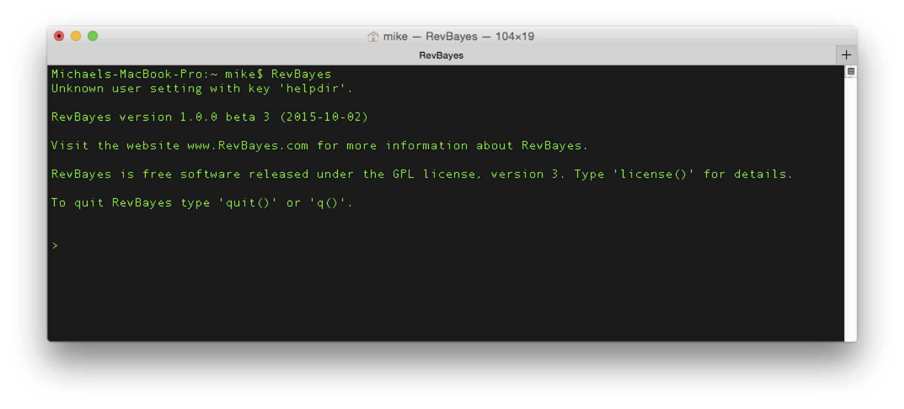
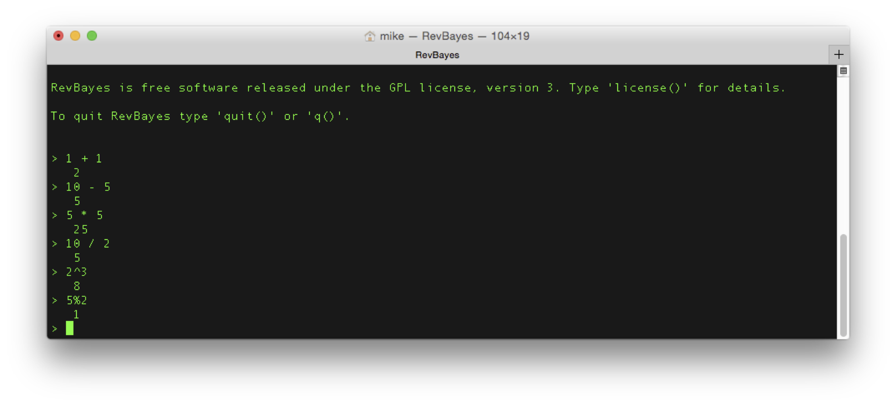

Basic Rev Commands
==============
{:.section}

This tutorial demonstrates the basic syntactical features of RevBayes
and the Rev scripting language. A good reference for probabilistic graphical models for
Bayesian phylogenetic inference is given in . Let’s start with the basic concepts
for the interactive use of RevBayes with Rev (the language of
RevBayes). You should try to execute the statements step by step, look
at the output and try to understand what and why things are happening.

First, open up your terminal and type RevBayes. This should launch RevBayes and give you
a command prompt (the `>` character). This means RevBayes is waiting for input.

Operators and Functions
-----------------------
{:.subsection}

Rev is an interpreted language for statistical computing and phylogenetic
analysis. Therefore, the basics are simple mathematical operations.
Entering each of the following lines will automatically execute these
operations.

    # Simple mathematical operators:
    1 + 1                            # Addition
    10 - 5                           # Subtraction
    5 * 5                            # Multiplication
    10 / 2                           # Division
    2^3                              # Exponentiation
    5%2                              # Modulo

From now on, we will omit images of the terminal.

Each set of operations constitutes a *statement*. As you work through
these tutorials, it is helpful to write the statements you enter into a
blank text file, then copy-and-paste the statements into to execute
them. This way, you have a complete history of everything you’ve done,
and can easily start over without having to rewrite everything. We refer
to the text file containing the list of commands as a *script*, because
it describes line-by-line instructions for the program to follow.

You can write multiple statements in the same line if you separate them
by a semicolon (`;`). The statements will execute as if you wrote each
on a single line.

    1 + 1; 2 + 2                    # Multiple statements in one line

Here you can see that comments always start with the hash symbol (`#`).
Everything after the `#`-symbol will be ignored. In addition to these
simple mathematical operations, provides some standard math functions
which can be called by:

    # Math functions
    exp(1)                           # exponential function
    ln(1)                            # logarithmic function with natural base
    sqrt(16)                         # square root function 
    power(2,2)                       # power function: power(a,b) = a^b

Notice that Rev is case-sensitive. That means, Rev distinguishes upper and lower
case letter for both variable names and function names. For example,
only the first of these two calls will work:

    exp(1)                           # correct lower case name
    Exp(1)                           # wrong upper case name

Variable Declaration and Assignment
-----------------------------------
{:.subsection}

One of the most important features of (or any programming language,
really) is the ability to declare and assign variables. Variables store
information to be referenced later, and can change throughout the
execution of the program. There are three kinds of variables in RevBayes, called
*constant*, *deterministic*, and *stochastic* variables. Constant
variables contain values that are not random in your model.
Deterministic variables are functions of other variables. Stochastic
variables are random variables in your model, and will change during
your analysis; importantly, stochastic variables (being random
variables) are always associated with a particular statistical
distribution.

Different types of variables differ in how you create them and assign
values to them. We will begin by creating a constant variable with name
`a` that starts with the value 1. The left arrow assignment (`<-`)
always creates a constant variable, and automatically assigns the
following value to it.

    # Variable assignment: constant
    a <- 1                           # assignment of constant node `a'

You see the value of ‘a’ by just typing in the variable name and
pressing enter.

    a                                # printing the value of `a'

Next, we create a deterministic variable `b` using the `:=` assignment
computed by `exp(a)` and another deterministic variable `c` computed by
`ln(b)`. Deterministic variables are always created using the
colon-equal assignment (`:=`).

    # Variable assignment: deterministic

    # assignment of deterministic node `b' with
    # the exponential function with parameter `a'
    b := exp(a)  
    b

    # assignment of deterministic node `c' with
    # logarithmic function with parameter `b'
    c := ln(b)              
    c 

Finally, we will create the third type of variables in RevBayes: stochastic
variables. We will create a random variable `x` from an exponential
distribution with parameter `lambda`. Stochastic assignments use the
$\sim$ operation.

    # Variable assignment: stochastic

    # assign constant node `lambda' with value `1'
    lambda <- 1.0

    # create stochastic node with exponential 
    # distribution and parameter `lambda'
    x ~ dnExponential(lambda)

The value of `x` is a random draw from the distribution. You can see the
value and the probability (or log-probability) of the current value
under the current parameter values by

    x                                # print value of stochastic node `x'
    x.probability()                  # print the probability if `x'
    x.lnProbability()                # print the log-probability if `x'

Distributions and Random Numbers
--------------------------------
{:.subsection}

RevBayes provides functions for common statistical distributions. We'll
demonstrate by generating random exponential numbers as we did in
lecture. Recall that we can transform a random variable $u$ sampled from
a Uniform(0,1) distribution into an exponential distribution with rate
parameter $\lambda$:

$$\begin{aligned}
    u &\sim \text{Uniform(0,1)}\\
    x &= -\frac{\ln u}{\lambda} \end{aligned}$$

In RevBayes, we might describe
$u$ as a stochastic variable, and $x$ as a deterministic variable (since
it is a function of $u$):

    # create the random variable u
    u ~ dnUniform(0,1)
    u

    # determine the rate parameter
    lambda <- 1.0

    # create x as a deterministic function of u
    x := -ln(u) / lambda
    x

Alternatively, we can create $x$ directly as an exponential random
variable:

    # create the random variable x
    x ~ dnExponential(lambda)
    x

Vectors
-------
{:.subsection}

Individual variables can have more than one value. Variables that have
more than one value are called *vectors*. The simplest way to create a
vector is like this:

    v <- v(1.0,2.0,3.0)              # create a vector

You can refer to a specific value in the vector using brackets, `[i]`,
where `i` is the index of the variable of interest.

    v[1]                             # print the first entry
    v[1] <- 10                       # change the value of the first entry
    v

`for` loops
-----------
{:.subsection}

`for` loops are important programming structures that allow you to
repeat the same statement a number of times on different variables. The
basic structure of a `for` loop is:

    # a for loop
    for ([variable] in [set of values]) {
       [statements using variable]
    }

The `for` statement is followed by a set of parenthesis containing
`[variable]`, which contains the name of the variable being iterated,
and `[set of values]`, which are the values that the variable iterates
over. The `for` loop variable is a special variable that is created by
the `for` loop: you do not have to create it before executing the loop.
This simple `for` loop creates the variable `i`, and for each value of
`i` from 1 to 100, prints the value of `i` to the screen.

    for (i in 1:100) {
      i
    }

`for` loops are very powerful programming tools. We can use a `for` loop
to create an entire *vector* of uniform random numbers, and transform
them into a *second* vector of exponential random numbers.

    for (i in 1:100) {
      u[i] ~ dnUniform(0,1)
      x[i] := -ln(u[i]) / lambda 
    }

Close using the statement `q()`.

    q()
